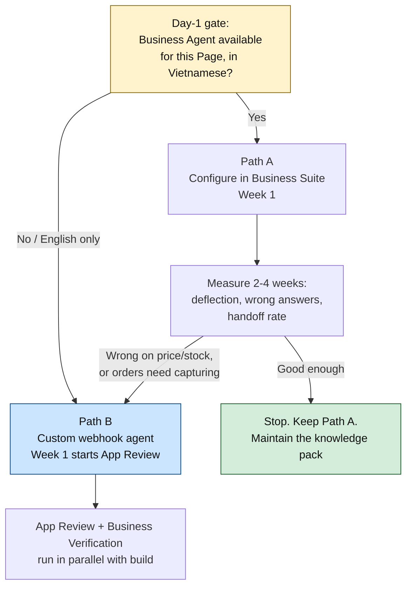
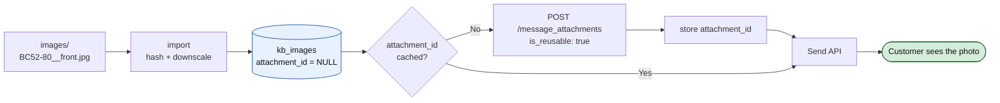
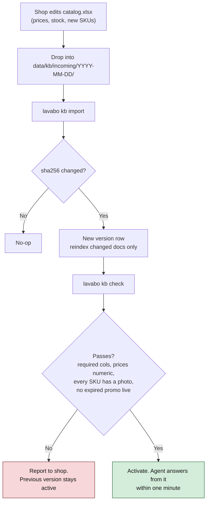
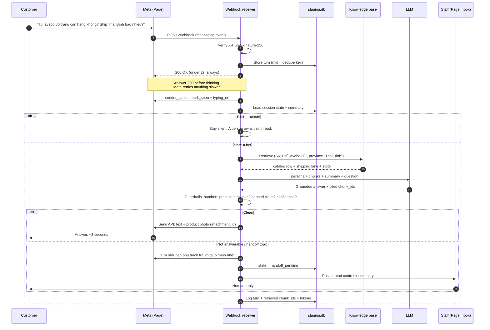
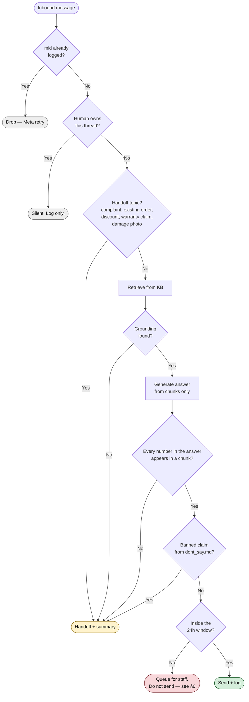
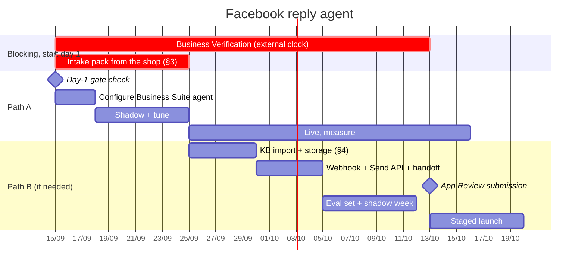

# Facebook reply agent — setup plan

**Goal:** when someone messages the Page on Facebook (or comments on a post), they get a
correct, on-brand answer in seconds, at 11pm, without a human typing it — and the moment
the question is one a bot should not answer, a human gets it with the context intact.

Today the Page has none of this. The existing code reads Meta conversations *after the
fact* (`src/lavabo/connectors/meta_graph.py`) and turns them into Excel. Replying is a new
capability, and this document is the plan for it.

It is written to be read in three passes:

- **§1–2** — the decision, and what the thing actually is.
- **§3–5** — *what the shop has to hand over, in what format, and where it gets stored.*
  This is the part that blocks everything else, and it's the part only the shop can do.
- **§6–12** — Meta configuration, guardrails, phases, cost, risk.

> **Sourcing note.** `developers.facebook.com` is not reachable from the environment this
> was written in, so every Meta-specific claim below is marked either **[verified]**
> (confirmed against Meta's own docs previously, stable for years) or **[confirm]**
> (from secondary sources in Sept 2026 — re-read Meta's docs before you rely on it). The
> **[confirm]** items are concentrated in §6 and they are the ones that move schedules.

---

## 1. The decision: two paths, and which one to take

There are two genuinely different ways to answer Facebook messages automatically, and
choosing wrong costs weeks.

### Path A — Meta Business Agent (native, inside Meta Business Suite)

Meta shipped a built-in AI agent for business inboxes; it went generally available on
3 June 2026 and is configured from Business Suite: you give it **Knowledge** (business
info, FAQs, website, uploaded files, product catalog), **Personality**, **Audience**, and
**Handoff** rules, and it answers on Messenger/Instagram/WhatsApp. There is also a
Business Agent Platform API for configuring knowledge, actions and handoff
programmatically. **[confirm]**

- **No server, no App Review, no webhook.** Hours of configuration, not weeks.
- You cannot make it read live stock, quote a negotiated price, or write an order into
  `QUẢN LÝ ĐƠN SENKAHOMES.xlsx`. It knows what you uploaded, nothing more.
- Vietnamese support for the agent itself is **unconfirmed** — Vietnamese appears in
  Meta's supported-document-language lists, which is not the same statement. **[confirm]**

### Path B — Custom agent on this repo's stack

A webhook receiver (the shape already exists: `scripts/lavabo_webhook.py`), a knowledge
base built from the shop's own files, the LLM provider already configured
(`extract.provider` in `config/config.yaml`), and the Send API.

- Full control of what it says, full log of why it said it, and the conversation lands in
  the same `data/staging.db` the order pipeline already reads — so a Messenger chat that
  turns into an order flows into the monthly workbook with no second capture step.
- Costs App Review + Business Verification for `pages_messaging` Advanced Access, a
  permanently-reachable HTTPS endpoint, and ongoing ownership.

### Recommendation

**Do A now, and build B only for what A cannot do.**

The shop's blocking problem is that questions go unanswered overnight. Path A fixes that
this week without touching App Review, which per §6 is the long pole on any custom path.
Path B is worth building only once we know which questions the native agent gets wrong —
and we will know, because every conversation is already being pulled into staging and can
be graded.

**Day-1 gate (30 minutes, do this before anything else):** open Business Suite → Inbox →
Automations/AI and check whether the Business Agent is offered for *this* Page in
Vietnam, in Vietnamese. The answer splits the plan:



**The intake pack in §3 is identical for both paths.** Path A uploads it to Meta; Path B
indexes it locally. So the shop's homework starts today regardless of the gate's answer,
and nothing they do is wasted.

---

## 2. What the agent is, in scope terms

| In scope | Out of scope (v1) |
|---|---|
| Answer product questions: price, size, material, colour, availability | Negotiating a discount |
| Shipping fee + delivery time by province | Taking payment |
| Deposit (cọc), warranty, installation, returns policy | Changing or cancelling an existing order |
| Send product photos on request | Complaints, warranty claims |
| Collect name / phone / address when the customer wants to order | Anything about someone's existing order |
| Hand off to a human with a summary | Instagram + WhatsApp (add after Messenger is stable) |
| Private-reply to comments asking "giá bao nhiêu?" | Posting public comment replies |

Everything in the right-hand column is a **handoff trigger**, not a gap. The agent's job on
those is one sentence and a clean pass to a person.

---

## 3. What the customer must provide

This is the part that blocks everything. The agent is only as good as this pack, and none
of it can be invented on their behalf — a wrong price quoted publicly by an automated
account is worse than no reply at all.

Deliver as **one folder** (Drive/Zalo/USB — whatever is easy), structured as below. Every
file is listed with what breaks if it's missing.

### 3.1 Accounts and access — half a day of the owner's time

| # | What | Why | Who can do it |
|---|---|---|---|
| 1 | **Admin (full control) role on the Facebook Page** for the person configuring | Nothing below is possible at Editor level | Page owner |
| 2 | Page added to a **Meta Business Manager / Business Portfolio** | Required for verification and for any API path | Page owner |
| 3 | **Business Verification** started (business licence — GPKD, tax code, address, phone) | Prerequisite for Advanced Access on Path B; days-to-weeks turnaround | Owner |
| 4 | **Page ID** | `meta.page_id` in `config/config.yaml` | Anyone with admin |
| 5 | Privacy-policy URL reachable on the public web | Required by App Review; also the right thing | Owner |
| 6 | Decision: **which staff member is the escalation target**, and their hours | Handoff has to land on a person, not a void | Owner |

> Start **#3 on day one even if you choose Path A.** It is the only item with an
> unbounded, externally-controlled clock, and Path B is unreachable without it.

### 3.2 Knowledge files — the core pack

| File | Format | Required | Contains | What breaks without it |
|---|---|---|---|---|
| `catalog.xlsx` | Excel, one row per SKU | **Yes** | mã SP, tên, loại, kích thước, chất liệu, màu, giá niêm yết, giá KM, tình trạng (còn/hết/đặt trước), thời gian giao, bảo hành, tên file ảnh | The agent cannot answer *any* product question. This is the single highest-value file |
| `shipping.xlsx` | Excel | **Yes** | tỉnh/thành → phí ship, thời gian, ngưỡng miễn phí, phụ phí cồng kềnh | "Ship về Thái Bình bao nhiêu?" is one of the most common questions and it has a *table* answer, not a guess |
| `policies.md` (or .docx) | Text | **Yes** | cọc %, thanh toán, bảo hành (what's covered, what isn't, how long), đổi trả, lắp đặt, thời gian xử lý | The agent invents policy, which is a real liability |
| `faq.xlsx` | Excel, Q + A columns | **Yes** | 30–50 real questions with the answer staff actually give | Without it the tone is generic and the common 80% is answered from scratch every time |
| `store.md` | Text | **Yes** | Addresses, opening hours, hotline, Zalo, website, social links, service area | "Cửa hàng ở đâu?" / "Mấy giờ đóng cửa?" |
| `promotions.xlsx` | Excel | If any | Promotion name, applies-to (SKU or category), discount, **start and end date** | Expired promotions get quoted forever. The end date is mandatory, not optional |
| `synonyms.xlsx` | Excel, two columns | Recommended | What customers type → what the catalog calls it: `sen cây` → `sen tắm đứng`, `lavabo` → `chậu rửa`, `tủ 80` → `tủ lavabo 80cm` | Customer words rarely match catalog words; search misses and the agent says "I don't have that" about a product on the shelf |
| `dont_say.md` | Text | Recommended | Claims never to make: competitor comparisons, health/safety claims, delivery promises by date, "chắc chắn còn hàng" | One over-promise becomes a dispute |

**Rules that make the difference between a usable pack and a useless one:**

1. **One fact, one place.** If a price is in both `catalog.xlsx` and `faq.xlsx`, one of them
   will go stale and the agent will confidently quote it. The catalog is the price
   authority; the FAQ must never restate a number.
2. **Prices in numbers, not prose.** `2850000`, not `2tr850` or `2.850.000đ/cái`. The
   importer normalises what it can (`src/lavabo/money.py` already knows `tr`/`k`), but a
   clean column is one less place to be wrong.
3. **"Hết hàng" must be a real state.** A catalog where everything says "còn hàng" trains
   the agent to promise stock the shop doesn't have. If stock isn't tracked, set the column
   to `đặt trước` and let the agent say so.
4. **Empty beats wrong.** A blank cell makes the agent say "để em kiểm tra lại giúp mình" and
   hand off. A wrong cell makes it lie.

### 3.3 Images — what to send and how to name them

Photos are a first-class part of the answer here. "Cho em xem mẫu tủ 80 màu trắng" is
answered with a picture or it isn't answered.

| Item | Requirement |
|---|---|
| **Coverage** | At least one photo per SKU in `catalog.xlsx`. Best-selling SKUs: 3–5 (front, angle, detail, installed-in-a-real-bathroom) |
| **Naming** | `<mã SP>__<role>.jpg` — `BC52-80-TRANG__front.jpg`, `BC52-80-TRANG__lapdat.jpg`. Roles: `front`, `angle`, `detail`, `lapdat`, `size` |
| **If renaming is too much work** | Keep phone names (`IMG_4821.jpg`) and add `images.xlsx`: filename, mã SP, role, caption. Either way the mapping must exist — an unmapped photo is invisible to the agent |
| **Format / size** | JPG or PNG, longest side ≥1200px, under 8MB each. Oversized phone photos are downscaled at import; HEIC must be converted first |
| **Size charts / spec drawings** | Very valuable. Name `<mã SP>__size.jpg` |
| **What NOT to send** | Screenshots containing other customers' names or phone numbers; photos with a competitor's watermark; anything the shop doesn't own the rights to |

Nothing about this needs a designer. A phone, good light, and a consistent filename.

### 3.4 Voice and rules — one short form, 30 minutes

A file `voice.md` answering, in the shop's own words:

- **Xưng hô:** "em" / "shop" / "bên mình"? Customer is "anh/chị" or "bạn"?
- **Length:** two sentences, or a full explanation? (Recommended: 2–3 sentences, then offer.)
- **Emoji:** yes/no.
- **Greeting** the agent opens with — and it must say it's an automated assistant (§7).
- **Closing move:** always ask for a phone number? Always offer to send photos?
- **Handoff sentence:** exactly what the customer sees when a human is being fetched.
- **Working hours** for handoff, and what the agent says outside them.
- **Three sample conversations**, written by whoever answers messages today: a price
  question, a shipping question, and one awkward one. These are worth more than any style
  guide — they become the few-shot examples in the prompt.

### 3.5 What the shop does *not* need to provide

Worth saying explicitly, because it saves them days:

- **Past Messenger conversations.** Already reachable through `lavabo ingest --source meta`
  and already staged in `data/staging.db`. We mine the real question distribution from
  there — which questions actually get asked, in the customer's real wording, and how staff
  answer them. That's where `faq.xlsx` and `synonyms.xlsx` get their second draft.
- **A website.** Nice for Path A's URL crawler; not required.
- **Any technical setup.** Everything in §3 is Excel, photos and a text file.

### 3.6 The folder they hand over

```
intake/
├── catalog.xlsx
├── shipping.xlsx
├── promotions.xlsx
├── faq.xlsx
├── synonyms.xlsx
├── policies.md
├── store.md
├── dont_say.md
├── voice.md
└── images/
    ├── images.xlsx              # only if filenames aren't SKU-based
    ├── BC52-80-TRANG__front.jpg
    ├── BC52-80-TRANG__lapdat.jpg
    └── ...
```

**Minimum viable pack** — enough to launch a pilot on a narrow topic set:
`catalog.xlsx` + `shipping.xlsx` + `policies.md` + `store.md` + one photo per top-20 SKU.
Everything else improves quality; these four make it possible at all.

---

## 4. How the material is stored for the agent to use

Two answers, because the two paths store it differently.

**Path A:** upload `policies.md`, `faq.xlsx` (exported to PDF or pasted as FAQ entries),
`store.md` into Business Suite's Knowledge section; connect the product catalog through
Commerce Manager so photos and prices come from a structured feed rather than free text;
point the website crawler at the site if one exists. Meta hosts and indexes it. **Keep the
`intake/` folder as the master copy** — Business Suite's fields are an output of it, not
the source of truth, or the next refresh becomes archaeology. **[confirm]** the exact
accepted file types and size limits in Business Suite before promising the shop anything.

**Path B** is the rest of this section.

### 4.1 Layout on disk

```
data/
├── staging.db              # existing: conversations, messages, extractions
├── kb/
│   ├── incoming/           # exactly what the shop sent, never edited — the audit copy
│   │   └── 2026-09-13/     # every drop keeps its date; nothing is overwritten
│   ├── images/
│   │   ├── original/       # as received, sha256-named to kill duplicates
│   │   └── send/           # downscaled ~1600px JPEG, what actually goes to Messenger
│   └── inbound/            # photos CUSTOMERS send us (see §4.4)
└── out/
```

`data/` is already gitignored — **customer content must never be committed**, and the
inbound folder makes that rule matter more, not less.

### 4.2 Tables — an extension of the existing SQLite store

These slot into `SCHEMA` in `src/lavabo/store.py` alongside `conversations` /
`messages` / `extractions`. Same file, same idempotent-upsert discipline, no new
infrastructure.

```sql
-- One row per file the shop handed over. Re-importing an unchanged file is a no-op.
CREATE TABLE IF NOT EXISTS kb_sources (
    source_id    TEXT PRIMARY KEY,        -- 'catalog', 'shipping', 'faq', ...
    path         TEXT NOT NULL,
    sha256       TEXT NOT NULL,
    version      INTEGER NOT NULL,
    imported_at  TEXT NOT NULL,
    row_count    INTEGER,
    active       INTEGER NOT NULL DEFAULT 1
);

-- One row per answerable fact: a SKU, a shipping lane, a policy section, an FAQ pair.
CREATE TABLE IF NOT EXISTS kb_docs (
    doc_id        TEXT PRIMARY KEY,       -- 'sku:BC52-80-TRANG', 'ship:thai-binh'
    source_id     TEXT NOT NULL,
    category      TEXT NOT NULL,          -- product | shipping | policy | faq | store | promo
    sku           TEXT,
    title         TEXT NOT NULL,
    body          TEXT NOT NULL,          -- the text the model is actually shown
    attributes    TEXT,                   -- JSON: price, size, colour, stock, ...
    effective_from TEXT, effective_to TEXT,   -- promos expire themselves
    updated_at    TEXT NOT NULL
);

-- Retrieval unit. Long policies split; a SKU stays whole.
CREATE TABLE IF NOT EXISTS kb_chunks (
    chunk_id   TEXT PRIMARY KEY,
    doc_id     TEXT NOT NULL,
    ordinal    INTEGER NOT NULL,
    text       TEXT NOT NULL,
    embedding  BLOB                       -- optional; §4.5
);

-- Vietnamese search. remove_diacritics=2 is the point: customers type "sen tam",
-- "sen tắm" and "SEN TAM" for the same thing, and all three must hit.
CREATE VIRTUAL TABLE IF NOT EXISTS kb_fts USING fts5(
    text, title, sku,
    content='kb_chunks', content_rowid='rowid',
    tokenize="unicode61 remove_diacritics 2"
);

-- Photos, and the cache that makes sending them cheap (§4.3).
CREATE TABLE IF NOT EXISTS kb_images (
    image_id        TEXT PRIMARY KEY,     -- sha256 of the original
    sku             TEXT,
    role            TEXT,                 -- front | angle | detail | lapdat | size
    caption         TEXT,
    original_path   TEXT NOT NULL,
    send_path       TEXT NOT NULL,
    attachment_id   TEXT,                 -- Meta's reusable id; NULL until first send
    uploaded_at     TEXT,
    bytes           INTEGER
);
CREATE INDEX IF NOT EXISTS idx_kb_images_sku ON kb_images (sku, role);

-- One row per person in a Messenger thread, so the agent has memory and a state.
CREATE TABLE IF NOT EXISTS agent_sessions (
    psid            TEXT PRIMARY KEY,     -- page-scoped id; NOT a Facebook user id
    state           TEXT NOT NULL,        -- bot | handoff_pending | human | paused
    summary         TEXT,                 -- rolling context, cheaper than replaying history
    last_inbound_at TEXT, last_outbound_at TEXT,
    handed_off_at   TEXT,
    customer_name   TEXT, customer_phone TEXT
);

-- Every turn, verbatim, with the evidence. This is the audit trail and the eval set.
CREATE TABLE IF NOT EXISTS agent_turns (
    turn_id       TEXT PRIMARY KEY,
    psid          TEXT NOT NULL,
    mid           TEXT UNIQUE,            -- Meta message id: the dedupe key for retries
    direction     TEXT NOT NULL,
    text          TEXT,
    retrieved     TEXT,                   -- JSON: chunk_ids + scores the answer used
    model         TEXT, prompt_version INTEGER,
    input_tokens  INTEGER, output_tokens INTEGER,
    latency_ms    INTEGER,
    action        TEXT,                   -- answered | asked_clarify | handoff | suppressed
    error         TEXT,
    created_at    TEXT NOT NULL
);
```

`retrieved` is the column that earns its keep: when the shop says "the bot told a customer
the wrong price", you can see exactly which chunk it read, and fix the file instead of
arguing with the model.

### 4.3 Images: store once, upload once, send forever

Sending a photo on Messenger has a cheap path and an expensive one, and the difference is
one cached string.

1. **Import** — hash the original, downscale to ~1600px JPEG into `kb/images/send/`, read
   the SKU from the filename or `images.xlsx`, insert into `kb_images`.
2. **First send** — upload to Meta's attachment endpoint with `is_reusable: true`; Meta
   returns an `attachment_id`. Store it. **[verified]**
3. **Every later send** — send the `attachment_id`. No upload, no public URL for the photo,
   noticeably faster, and the shop's photos never need to be hosted anywhere. **[verified]**



Invalidate on content change: the `image_id` is the file hash, so a re-shot photo is a new
row and gets its own upload. Never mutate a row's `send_path` in place.

### 4.4 Images the customer sends *us*

Common here: a photo of their bathroom, a screenshot of a competitor's product, a photo of
a damaged item.

**Attachment URLs in Messenger webhooks are signed and expire.** Download at webhook time,
into `data/kb/inbound/<psid>/<mid>.jpg`, before doing anything else — the same "store
verbatim, parse later" rule that `scripts/lavabo_webhook.py` already follows for Zalo. A
photo you decided to skip cannot be re-fetched an hour later. **[verified]**

Then: the configured vision model (the repo already reads images with Gemini in
`src/lavabo/video.py`) describes it → "white 80cm cabinet, round mirror" → that text goes
into retrieval like any other query. A damage photo is an automatic handoff, never an
answer.

### 4.5 Retrieval — keyword first, embeddings only if needed

For a catalogue of hundreds of SKUs, **FTS5 with diacritics folded plus the synonym table
is the right first implementation**, and probably the last. It is exact, debuggable ("why
did it pick that row" has an answer), costs nothing, and adds no new dependency.

The order of operations per question:

1. Normalise the query; expand through `synonyms.xlsx`.
2. FTS5 over `kb_chunks`, boosted when the query names a SKU or a province.
3. Take the top 6–8 chunks, hard-capped at ~2,500 tokens.
4. Build the prompt: `voice.md` persona + the retrieved chunks + last ~6 turns of session
   summary + the question.
5. Answer **only** from the chunks. No chunk → no number. Say so and offer a human.

Add embeddings later, and only if the logs show paraphrase misses FTS can't catch. The
`embedding` column is there so that's a backfill, not a migration.

### 4.6 Refresh — how the pack stays true



Two rules make this survivable: **the previous version stays live until the new one
passes**, and **no file is ever edited in place** — a new drop is a new dated folder. A
Tuesday price change must never be able to take the agent down.

Cadence: prices and stock weekly (or on change), promotions on the day they start,
FAQ monthly from the previous month's logs.

---

## 5. What happens when a message arrives



### The reply policy, as a decision



The "every number appears in a chunk" check is cheap, mechanical, and catches the single
worst failure mode: a fluent, wrong price. If the model writes `2.850.000đ` and no
retrieved chunk contains `2850000`, the answer does not go out.

---

## 6. Meta configuration (Path B)

### Permissions

| Permission | For | Access level needed |
|---|---|---|
| `pages_messaging` | Receive and send Page messages | **Advanced** — App Review + verified business |
| `pages_manage_metadata` | Subscribe the app to the Page's webhooks | Advanced |
| `pages_read_engagement` | Read Page content | Advanced |
| `pages_manage_engagement` | Private-reply to comments | Advanced, only if comments are in scope |
| `instagram_manage_messages` | IG DMs | Advanced, later |

**Standard Access only sees people with a role on the app or Page.** You can build and test
the entire agent against your own account; you cannot serve one real customer. This is the
same wall documented in [docs/04-meta-setup.md](04-meta-setup.md) and it is *the* schedule
risk. **[verified]**

### Webhook

- Public HTTPS endpoint, verified with a `hub.verify_token` GET challenge, then POST
  deliveries. Subscribe the Page via `POST /{PAGE_ID}/subscribed_apps`. **[verified]**
- Fields: `messages`, `messaging_postbacks`, `messaging_optins`, `message_echoes`
  (so staff replies from the Page Inbox are seen and the bot shuts up), and `feed` if
  comments are in scope. **[verified]**
- **Verify `X-Hub-Signature-256` on every delivery** (HMAC-SHA256 of the raw body with the
  app secret). `scripts/lavabo_webhook.py` already has the fail-closed shape for this —
  don't start the server without a secret. **[verified]**
- **Answer 200 in under a couple of seconds and do the work after.** Meta retries a slow or
  failed delivery, which without `mid` deduplication means answering twice. **[verified]**
- Needs to be up whenever the Page is. A laptop behind a tunnel is fine for the pilot
  ([docs/08-tailscale.md](08-tailscale.md)); it is not fine for production —
  [docs/09-cloud-architecture.md](09-cloud-architecture.md) §6 has the cheap always-on option.

### Messaging windows — read this before promising anything

- The **24-hour window** opens when the person messages the Page; you can reply freely
  inside it. **[verified]**
- Outside it: **Message Tags were deprecated in 2026** — reported as removed on 9 February
  2026, with `CONFIRMED_EVENT_UPDATE`, `ACCOUNT_UPDATE` and `POST_PURCHASE_UPDATE`
  returning error 100 from 27 April 2026. The `HUMAN_AGENT` tag (7 days, humans only,
  explicitly not for bots) may or may not be covered by the same removal — **[confirm]
  before designing any follow-up on it.** **[confirm]**
- **Design consequence, and it's a real one:** there is no reliable way to re-open a
  conversation later. A thread that goes quiet for 24 hours is closed. So — answer fast,
  hand off *inside* the window, and never write "em sẽ báo lại sau" unless a human will
  actually reply today. Staff hours and the handoff SLA have to fit inside 24 hours.

### Page-level setup (no App Review needed, do it today either way)

- **Greeting text** — shown before the first message; this is where the automated-assistant
  disclosure lives.
- **Ice breakers** — 3–4 tap-to-ask starters ("Bảng giá tủ lavabo", "Phí ship", "Bảo hành
  thế nào?"). These steer customers into questions the agent answers well, which raises
  measured quality more than any prompt tuning.
- **Persistent menu** — hotline, địa chỉ, "gặp nhân viên".
- **Handover Protocol** — the agent is primary receiver, the Page Inbox is secondary; a
  handoff is `pass_thread_control` to the Page Inbox app. Without this, staff and bot type
  over each other in the same thread. **[verified]**

### App Review submission — what gets rejected

Rejections are rarely about the code. Prepare: a screencast showing the real message flow
end to end, a plain description of why the Page needs each permission, a reachable privacy
policy, test credentials, and a completed Business Verification. Budget **2–6 weeks** and
assume at least one round trip. **[confirm]** current requirements at submission time.

---

## 7. Guardrails

| Rule | Implementation |
|---|---|
| **Say it's a bot** | First line of the greeting and of the first reply: an automated assistant, a person is available. Required by Meta's platform policy and simply correct. **[confirm]** exact wording rules |
| **Never invent a number** | The number-grounding check in §5. Violation → handoff, not a guess |
| **Never promise stock or a delivery date** | `dont_say.md` phrases are checked against the draft before sending |
| **Handoff beats a weak answer** | Below the grounding threshold, hand off. Measure the handoff rate; don't tune it to zero |
| **Kill switch** | One config flag, or one command, that stops all outbound sending immediately and leaves the webhook logging. Test it before launch, not after |
| **Rate limit** | Max N outbound per thread per hour; no reply to a message the agent itself echoed |
| **PII** | Phone numbers and addresses stay in the local DB, out of git, out of logs beyond the DB. Customer photos in `data/kb/inbound/` are business records — set a retention period with the owner. Vietnam's PDPD obligations apply; **confirm with the shop's own advisor** |
| **Quiet hours** | Optional: outside staff hours the agent still answers but says when a human is next available |

---

## 8. Testing and acceptance

Build the eval set **from the shop's own history**, which already exists in staging:

1. `lavabo ingest --source meta --full` (needs the Page token from §3.1).
2. Pull the 100 most common real customer questions from `messages` where
   `direction = 'inbound'`, and the staff reply that followed.
3. That's the test set: question in, staff's actual answer as the reference.

| Gate | Threshold |
|---|---|
| Correct on the 100-question set | ≥90% materially correct, **0 wrong prices** |
| Wrong number sent | Zero. One is a launch blocker |
| Handoff works | 100% of handoff topics reach a person, with summary |
| Latency | Median under 5s |
| Shadow week | Agent drafts, staff sends. Staff edit rate under 20% before going live |

**Launch in stages:** shadow (drafts only) → live outside business hours only → live
always. Each stage a week, each with a documented rollback (the kill switch).

Ongoing, monthly: deflection rate (threads closed with no human), handoff rate, edit rate,
cost per conversation, and the top 10 questions that produced a handoff — that last list is
the next month's `faq.xlsx` edit.

---

## 9. Phases



| Phase | Deliverable | Blocked by |
|---|---|---|
| 0 | Day-1 gate; Business Verification started; intake pack requested | Owner's half day |
| 1 | Path A configured and answering | Gate = yes, intake pack |
| 2 | Measurement: what A gets wrong | 2–4 weeks of live traffic |
| 3 | KB import + storage (§4), graded against the eval set with no Meta dependency at all | Intake pack |
| 4 | Webhook, Send API, handoff, guardrails | Phase 3 |
| 5 | App Review → staged launch | Business Verification, Phase 4 |

Phases 3 and 4 need **no Meta approval** — the knowledge base and the answer quality can be
built and graded entirely offline against the eval set. That's deliberate: it keeps the
external clock off the critical path for everything except the final send.

---

## 10. Cost

| Item | Monthly |
|---|---|
| LLM — assume 500 conversations × 4 turns, ~3k in / 250 out per turn on Gemini Flash-class | Free tier plausibly covers it; a few USD at worst. Retrieval is what keeps it there — prompting the whole catalogue every turn would be 20× |
| Vision on inbound photos | Negligible at this volume |
| Hosting the webhook | 0 if it runs on the shop's machine behind a tunnel; ~5 USD for a small always-on VPS |
| Meta | 0 for Messaging. Business Agent pricing on the WhatsApp side **[confirm]** |
| Human | The real cost: ~2 days of owner time for the intake pack, then ~2 hours/month of maintenance |

The dominating cost is the intake pack, and it is paid in the shop's time, not in money.

---

## 11. Risks

| Risk | Likelihood | Mitigation |
|---|---|---|
| **Intake pack never arrives complete** | High — this is the usual failure | Launch on the minimum pack (§3.6) and a narrow topic set. A working agent answering 4 topics pulls the rest of the pack out of the shop; a stalled project never does |
| Business Agent not available in Vietnamese | Medium | Day-1 gate. Falls back to Path B, which is language-agnostic |
| App Review rejected or slow | Medium-high | Verification started day 1; Path A serves customers meanwhile; phases 3–4 don't wait on it |
| **Agent quotes a stale price** | Medium | Catalog is the single price authority; weekly refresh; number-grounding check; every answer's sources logged |
| Wrong answer damages a sale | Medium | Shadow week; staged launch; handoff-over-guess; kill switch |
| Staff and bot reply over each other | High if unmanaged | Handover Protocol + `message_echoes` + session state |
| 24h window closes before a human replies | Medium | Handoff SLA inside the window; no "we'll get back to you" past today; see §6 |
| Webhook down, messages lost | Medium | Meta retries for a while, but not forever. Uptime alert; `lavabo ingest --source meta` still backfills the transcript afterwards, so nothing is permanently lost from the *record* |
| PII in an unexpected place | Low-medium | `data/` gitignored, DB-only storage, retention period agreed with the owner |

---

## 12. Open questions for the shop

1. **Does the catalogue have stable SKUs?** If products are identified by description
   ("tủ 80 trắng bo góc") rather than a code, we create codes during import — and the shop
   must then use them. This decision propagates everywhere.
2. **Is stock real?** If nobody tracks it, the agent says "đặt trước" for everything and we
   stop pretending otherwise.
3. **Who owns the pack after launch?** One named person, or it goes stale in six weeks.
4. **Are comments in scope, or Messenger only?** Comments add `pages_manage_engagement`, a
   different webhook field, and the one-private-reply-per-comment rule. Recommended: v2.
5. **Instagram?** Same Page assets, lower rate limits, separate approval. Recommended: v2.
6. **What does the agent do outside staff hours** — answer and promise a morning callback,
   or answer and stop? §6's window rules make the first option risky.

---

## Related

| Doc | |
|---|---|
| [docs/04-meta-setup.md](04-meta-setup.md) | Page token, permissions, Advanced Access — the prerequisites for §6 |
| [docs/02-agent-plan.md](02-agent-plan.md) | The extraction pipeline this agent's conversations flow into |
| [docs/07-zalo-oa-flow.md](07-zalo-oa-flow.md) | The Zalo webhook flow — same receive-and-store shape |
| [docs/09-cloud-architecture.md](09-cloud-architecture.md) | Where a 24/7 webhook can actually live |

## Sources

Meta-specific claims marked **[confirm]** came from these secondary sources in September
2026 and were **not** verifiable against `developers.facebook.com` from the authoring
environment. Re-read Meta's own documentation before acting on them.

- [Meta Business Agent Platform overview — Meta for Developers](https://developers.facebook.com/documentation/meta-business-agent/overview)
- [Send a message — Messenger Platform](https://developers.facebook.com/documentation/business-messaging/messenger-platform/send-messages)
- [Messenger Platform and IG Messaging API policy](https://developers.facebook.com/documentation/business-messaging/messenger-platform/policy)
- [What Is Meta Business Agent? The Complete 2026 Guide](https://www.intelliconcierge.com/blog/what-is-meta-business-agent-the-complete-2026-guide)
- [Meta Business Agent 2026: WhatsApp, Messenger, Instagram Guide](https://news.creeta.com/en/meta-business-ai-whatsapp-messenger-instagram-2026/)
- [Meta Business Agent API: The Technical Onboarding Guide for Developers](https://www.memacon.com/meta-business-agent-api-the-technical-onboarding-guide-for-developers/)
- [How to send messages outside the 24-hour and 7-day windows — Manychat Help](https://help.manychat.com/hc/en-us/articles/14281199732892-How-to-send-messages-outside-the-24-hour-and-7-day-windows-in-Messenger-and-Instagram)
- [How To Comply with Facebook Messenger Rules in 2026 — Chatimize](https://chatimize.com/facebook-messenger-policy/)
- [Meta Advanced Access: Which Permissions Need App Review](https://singhamandeep.com/what-is-meta-advanced-access/)
- [Messenger Bot App Review: Why Chatbots Get Rejected (2026)](https://singhamandeep.com/facebook-messenger-bot-app-review-chatbot-saas/)
