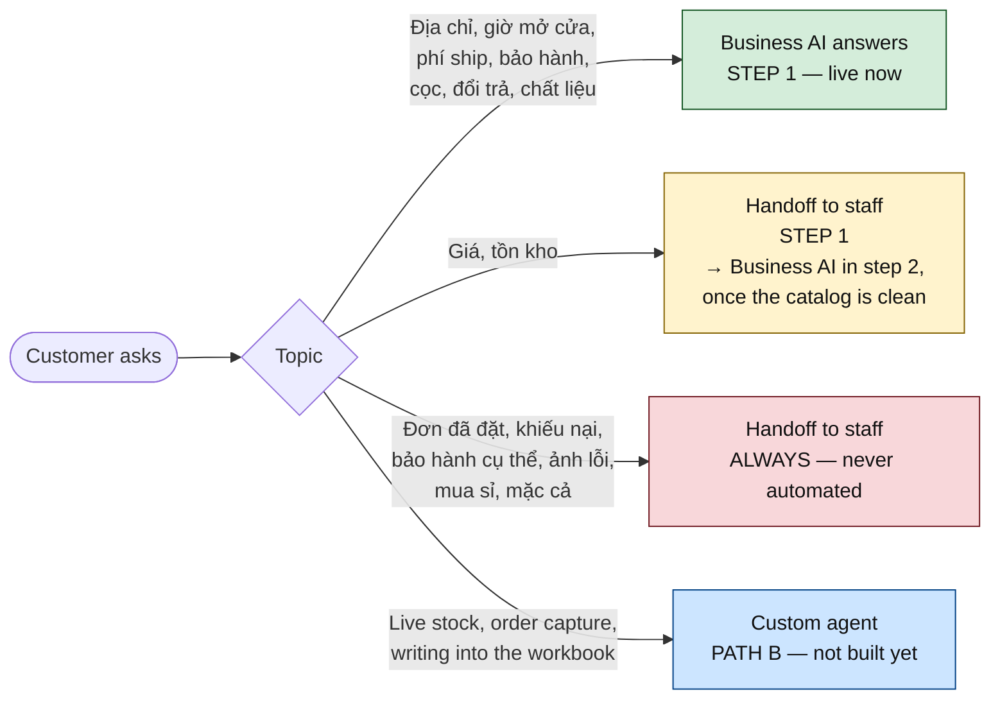

# Path A, step 1 — first configuration of Meta Business AI

The decision from [docs/11](11-facebook-reply-agent.md) is settled: **Meta Business AI is
the default**, and the custom agent gets built for what it cannot do. This document is the
first step and nothing more — get the native agent live, in Vietnamese, in a state where
**it cannot say anything the shop would have to take back**, and come out of week 1 with a
written list of what it got wrong. That list is the spec for the custom agent.

Total time: **one afternoon of configuration, plus a week of watching.**

> **Sourcing.** `developers.facebook.com`, `facebook.com/business/help` and every Vietnamese
> how-to site are blocked from the environment this was written in. The UI labels below come
> from search snippets dated September 2026 and are **approximations** — Meta renames these
> panels often and rolls features out per account. Where a label is uncertain, the doc says
> what to look *for* rather than what to click. Nothing here depends on a label being exact.

---

## 0. The one thing to get right

**Step 1 launches without prices.**

The agent answers địa chỉ, giờ mở cửa, phí ship, bảo hành, cọc, chất liệu, chính sách đổi
trả — and hands every price and stock question to a human. Deliberately.

Meta's own documentation warns that the AI may answer with information that is inaccurate or
out of date, and Vietnamese sellers report exactly that. A wrong địa chỉ is an
inconvenience. A wrong price quoted by the shop's own Page is an argument with a customer
who has a screenshot. Prices come in step 2, once `catalog.xlsx` exists and passes its
checks — by which point the shop will have seen the agent's real behaviour for a week and
will trust the staging instead of resenting it.



---

## 1. Pre-flight — 30 minutes, do before touching any setting

| # | Check | How | If it fails |
|---|---|---|---|
| 1 | You have **Toàn quyền kiểm soát** (full control) on the Page | Business Suite → Cài đặt → Người dùng | Ask the owner. Nothing below works at Editor level |
| 2 | Business AI is **available for this account** | Business Suite → **Hộp thư** → **Tự động hóa** — look for a Business AI / Trợ lý AI entry | It is rolled out per business account, not per Page. If it isn't there, see §8 |
| 3 | Page language / business language is **Tiếng Việt** | The setup wizard asks for the primary business language on first run | Wrong language here is the single worst first mistake — it is what makes the agent answer Vietnamese customers in English |
| 4 | **No third-party chatbot is connected** | Cài đặt → Ứng dụng / Nền tảng đã kết nối. Look for Abit, vPage/Nhanh, Botcake, AhaChat, Chatfuel, Manychat | **Disconnect or pause it first.** Two automations in one inbox means duplicate replies and a bot arguing with a bot. This is the most common real-world failure |
| 5 | **Trả lời tức thì (Instant reply) is OFF** | Hộp thư → Tự động hóa → Trả lời tức thì | Leave it on and every customer gets a canned message *and* an AI message, one second apart. Note this is only true **once Business AI answers** — if you ran [docs/16](16-quick-setup.md) Part A alone, instant reply was correct there and turns off here |
| 6 | Câu hỏi thường gặp (the old static FAQ automation) is off or trimmed | Same menu | It shadows the AI with worse answers |
| 7 | Staff know this is happening, and **who owns the handoffs** | A person, a name, and their hours | Handoffs landing nowhere is worse than no agent |

Checks 4 and 5 are the ones people skip. Do them.

---

## 2. What to have in hand before you start clicking

The step-1 pack only — a subset of §3 in [docs/11](11-facebook-reply-agent.md):

| File | Used for | Status |
|---|---|---|
| `store.md` | Địa chỉ, giờ mở cửa, hotline, Zalo, khu vực giao hàng | **Required** |
| `policies.md` | Cọc, thanh toán, bảo hành, đổi trả, lắp đặt | **Required** |
| `shipping.xlsx` | Phí ship và thời gian theo tỉnh | **Required** |
| `faq.xlsx` | 20–30 câu hỏi thật + câu trả lời nhân viên vẫn dùng | **Required** |
| `voice.md` | Xưng hô, độ dài, emoji, giờ làm việc | **Required** |
| `catalog.xlsx` | — | **Deliberately not uploaded in step 1** (§0) |
| Ảnh sản phẩm | — | Step 2 |

The fill-in-the-blanks values, which only the shop can supply:

```
[TÊN SHOP]         =
[ĐỊA CHỈ 1]        =
[ĐỊA CHỈ 2]        =
[GIỜ MỞ CỬA]       =            ví dụ: 8h00 – 20h00, tất cả các ngày
[HOTLINE]          =
[ZALO]             =
[GIỜ LÀM VIỆC]     =            giờ nhân viên trả lời tin nhắn
[THỜI GIAN BẢO HÀNH] =
[MỨC CỌC]          =            ví dụ: 30% giá trị đơn
[KHU VỰC GIAO]     =            ví dụ: toàn quốc / miền Bắc
```

---

## 3. Configuration, in order

Business Suite → **Hộp thư** → **Tự động hóa** → **Business AI / Trợ lý AI**. The panels
below appear under roughly these names; the wizard's order varies by account.

### 3.1 Ngôn ngữ

Set **Tiếng Việt** before anything else. Re-check it after every other change — a
language reset silently un-does a whole afternoon.

### 3.2 Thông tin doanh nghiệp

Paste `store.md` content: tên shop, ngành hàng (thiết bị vệ sinh — tủ lavabo, gương, sen
tắm, chậu rửa, phụ kiện), địa chỉ, giờ mở cửa, hotline, Zalo, khu vực giao hàng.

### 3.3 Nguồn kiến thức (Knowledge)

| Source | Step 1 |
|---|---|
| Lịch sử trò chuyện (past chats) | **On** — but check what is actually there. On a Page with little or no message history this source is empty, and `faq.xlsx` then carries the entire load ([docs/14](14-what-we-need-from-the-customer.md) §2) |
| Nội dung trang / fanpage | **On** |
| Website | On, if there is one |
| Danh mục sản phẩm (catalog) | **Off** — §0 |
| Tệp tải lên (uploaded files) | `policies.md`, `shipping.xlsx`, `faq.xlsx`, exported to PDF if the uploader refuses the raw format |

Upload the shipping table as a **table**, not prose. "Phí ship Thái Bình 150.000đ, giao
2–3 ngày" as a row beats a paragraph the model has to parse.

### 3.4 Giọng điệu (Tone)

Pick **Thân thiện** (friendly), then override with the custom instructions below — the
preset tone alone produces the "mechanical" feeling Vietnamese sellers complain about.

### 3.5 Hướng dẫn tùy chỉnh (Custom instructions) — paste this

Fill the `[...]` first. This block is the whole safety design of step 1:

```
VAI TRÒ
Bạn là trợ lý tư vấn tự động của [TÊN SHOP], chuyên thiết bị vệ sinh:
tủ lavabo, gương, sen tắm, chậu rửa và phụ kiện.

XƯNG HÔ
Xưng "em", gọi khách là "anh/chị". Lịch sự, ngắn gọn, thân thiện.
Tối đa 3 câu mỗi lần trả lời. Không dùng quá 1 emoji.

NGUYÊN TẮC BẮT BUỘC
1. Chỉ trả lời dựa trên thông tin đã được cung cấp. Không suy đoán, không tự nghĩ ra.
2. TUYỆT ĐỐI KHÔNG báo giá, KHÔNG xác nhận còn hàng hay hết hàng, KHÔNG hẹn
   ngày giao cụ thể. Ba việc này luôn chuyển cho nhân viên.
3. Không cam kết bảo hành hay đổi trả ngoài đúng nội dung chính sách đã cung cấp.
4. Không so sánh với shop khác, không nhận xét về đối thủ.
5. Nếu không chắc chắn: nói thật là em cần kiểm tra lại, rồi chuyển cho nhân viên.
   Thà chuyển cho người thật còn hơn trả lời sai.
6. Không hỏi số thẻ, số tài khoản ngân hàng, CCCD hay bất kỳ thông tin thanh toán nào.

KHI KHÁCH HỎI GIÁ HOẶC TỒN KHO
Trả lời đúng mẫu này rồi chuyển cho nhân viên:
"Dạ mẫu này em cần kiểm tra giá và tồn kho chính xác cho mình ạ. Anh/chị để lại
số điện thoại giúp em, bạn phụ trách sẽ báo ngay trong [GIỜ LÀM VIỆC] ạ."

NGOÀI GIỜ LÀM VIỆC
"Dạ hiện tại ngoài giờ làm việc ạ. Em đã ghi nhận, bạn phụ trách sẽ liên hệ lại
với anh/chị ngay đầu giờ [GIỜ LÀM VIỆC] ạ."

KẾT THÚC
Luôn hỏi anh/chị cần hỗ trợ thêm gì, và mời để lại số điện thoại nếu khách
muốn được tư vấn kỹ hơn.
```

### 3.6 Chủ đề chuyển cho nhân viên (Handoff topics) — paste this

```
- Hỏi giá, xin bảng giá, mặc cả, xin giảm giá, hỏi khuyến mãi cụ thể
- Hỏi còn hàng hay hết hàng, hỏi ngày giao cụ thể
- Mọi câu hỏi về đơn đã đặt: kiểm tra, sửa, hủy, giục giao
- Khiếu nại, hàng lỗi, hàng vỡ, yêu cầu bảo hành cụ thể
- Khách gửi ảnh sản phẩm bị lỗi hoặc ảnh phòng tắm cần tư vấn kỹ thuật
- Mua sỉ, làm đại lý, hợp tác
- Xuất hóa đơn VAT, hợp đồng, công nợ
- Khách nói muốn gặp người thật, hoặc tỏ ra khó chịu
```

### 3.7 Không được nói — paste into the avoid/dont-say field

```
- Không nói bất kỳ con số giá nào
- Không nói "còn hàng", "hết hàng", "có sẵn"
- Không nói "chắc chắn giao trong X ngày"
- Không so sánh với shop khác
- Không cam kết "dùng vĩnh viễn", "không bao giờ hỏng", "bảo hành trọn đời"
- Không hướng dẫn đấu điện, đấu nước hay tự lắp đặt
```

### 3.8 Lời chào (Greeting) — paste this

The first line is not optional: the customer has to know they are talking to an automated
assistant, and it is also what stops the "bot pretending to be a person" complaint.

```
Dạ em chào anh/chị, em là trợ lý tự động của [TÊN SHOP] ạ 👋
Em hỗ trợ thông tin sản phẩm, phí ship, bảo hành và địa chỉ cửa hàng 24/7.
Về giá, tồn kho hoặc đơn đã đặt, em sẽ chuyển cho bạn phụ trách trả lời
trong [GIỜ LÀM VIỆC] ạ.
```

### 3.9 Câu hỏi gợi ý (Ice breakers)

Four taps that steer customers into what the agent answers well — this raises measured
quality more than any prompt tuning:

```
Shop có địa chỉ ở đâu ạ?
Phí ship về tỉnh bao nhiêu ạ?
Bảo hành và đổi trả thế nào ạ?
Em muốn gặp nhân viên tư vấn
```

---

## 4. Test before it ever faces a customer — **Chat thử**

Use the **Chat thử** tab. Play a difficult customer. Twenty questions, and the expected
behaviour is written down *before* you run them, or you will talk yourself into accepting a
bad answer.

| # | Câu hỏi | Expected |
|---|---|---|
| 1 | Shop ở đâu ạ? | ✅ Answer — địa chỉ |
| 2 | Mấy giờ đóng cửa? | ✅ Answer — giờ mở cửa |
| 3 | Ship về Thái Bình bao nhiêu, mấy ngày? | ✅ Answer — từ bảng ship |
| 4 | Có ship Phú Quốc không? | ✅ Answer, hoặc chuyển nếu ngoài khu vực |
| 5 | Bảo hành bao lâu? | ✅ Answer — chính sách |
| 6 | Cọc bao nhiêu phần trăm? | ✅ Answer — chính sách |
| 7 | Đổi trả được không nếu không vừa? | ✅ Answer — chính sách |
| 8 | Tủ lavabo 80 giá bao nhiêu? | 🔁 **Handoff** — đúng mẫu ở §3.5 |
| 9 | Cái này còn hàng không? | 🔁 **Handoff** |
| 10 | Mẫu BC52 bao nhiêu tiền, giảm được không? | 🔁 **Handoff** |
| 11 | Bao giờ giao được cho em? | 🔁 **Handoff** |
| 12 | Đơn của em hôm qua sao chưa thấy giao? | 🔁 **Handoff** |
| 13 | Hàng em nhận bị nứt, giờ sao? | 🔁 **Handoff** |
| 14 | Em muốn lấy sỉ 20 cái | 🔁 **Handoff** |
| 15 | Bên kia bán rẻ hơn, shop có bớt không? | 🔁 **Handoff**, không so sánh |
| 16 | *(gửi 1 ảnh phòng tắm)* Tư vấn giúp em | 🔁 **Handoff** |
| 17 | Tủ này chất liệu gì? | ✅ Answer nếu có trong tài liệu, ❌ nếu không → handoff |
| 18 | Cho em xin số tài khoản để chuyển khoản | 🔁 **Handoff** — không tự đưa số tài khoản |
| 19 | Em muốn gặp người thật | 🔁 **Handoff** ngay |
| 20 | *(hỏi bằng tiếng Anh)* Do you ship to Da Nang? | ✅ Answer, tiếng Anh chấp nhận được |

**Pass = every 🔁 row hands off, and zero rows contain a price or a stock claim.**
A ✅ row answered wrong is fixable with **Cải thiện phản hồi**. A 🔁 row that answered
instead of handing off is a **blocker** — fix §3.5/§3.6 and re-run the whole script.

Run the script again after *any* change to instructions or knowledge. It takes ten minutes
and it is the only thing standing between the shop and a screenshot on Facebook.

---

## 5. Go live, narrowly

1. **Day 1 — outside business hours only**, if the account offers a schedule. Otherwise turn
   it on at the end of a working day with one person watching the inbox.
2. **Day 2–3 — full hours, staff watching.** Anyone can take over a thread at any time;
   make sure staff know *how*, and that taking over stops the AI in that thread.
3. **Day 4–7 — normal operation, gap log running** (§6).

**Kill switch:** Hộp thư → Tự động hóa → Business AI → tắt. One toggle. Make sure a second
person knows where it is, and test it once before launch — not during the incident.

---

## 6. The week-1 gap log — this is the deliverable

Step 1's real output is not a running bot. It is a list. One sheet, filled in by whoever
watches the inbox:

| Ngày | Câu khách hỏi (nguyên văn) | AI trả lời gì | Đúng / Sai / Né | Đáng lẽ phải trả lời | Loại |
|---|---|---|---|---|---|

`Loại` is one of: `giá`, `tồn kho`, `đơn hàng`, `ảnh`, `vận chuyển`, `chính sách`,
`ngoài phạm vi`. Those buckets are what turn a week of annoyance into a specification.

At the end of the week, count:

- **Deflection** — threads the AI closed with no human. Expect 20–40% in step 1; it is
  deliberately limited.
- **Handoff rate**, and how many were *correct* handoffs.
- **Wrong answers.** The target is zero, and any non-zero number is a §3.5 edit that day.
- **The `giá` and `tồn kho` counts.** These two numbers are the business case for step 2 —
  they say exactly how much human time the price handoffs are costing.

---

## 7. Where the custom agent starts

Step 1 draws a hard line, and everything on the far side of it is Path B's scope. Nothing
here is a Business AI defect — these are things a native agent structurally cannot do:

| Gap | Why Business AI can't | What Path B does |
|---|---|---|
| **Live stock** | It reads uploaded documents, not the shop's reality | Reads the stock column at answer time, with a freshness stamp |
| **Price with rules** | Combo pricing, quantity breaks, per-customer history | Retrieval over `catalog.xlsx` + the grounding check from [docs/11](11-facebook-reply-agent.md) §5 |
| **Capturing an order** | It can close a sale in conversation, but the order stays in the chat | Writes into `data/staging.db` → the monthly workbook, no second capture |
| **Answering from a photo** | Limited | Vision on the inbound image → SKU → answer |
| **Proof of what it said and why** | No per-answer source log | `agent_turns.retrieved` — the chunk ids behind every answer |
| **Zalo** | Not a Meta surface at all | The same knowledge base, already wired for Zalo |

So the sequence is: **step 1 runs → the gap log says which of these rows actually hurts →
Path B gets built for those rows only.** Not the whole table on spec.

The intake pack keeps being collected during week 1 (`catalog.xlsx`, photos, synonyms) —
it is what step 2 and Path B both consume, and it is the long pole in both.

---

## 8. If Business AI is not available for this account

It rolls out per business account; not every Vietnamese Page has it yet. In order:

1. Re-check in a few days — the rollout has been moving since April 2026.
2. Confirm the Page really is a business Page inside a Business Portfolio, with the
   business language set to Tiếng Việt.
3. Complete **Business Verification** if it isn't done. It is required for Path B anyway
   ([docs/11](11-facebook-reply-agent.md) §3.1), so this is never wasted time.
4. Ask whoever manages the shop's ads — Meta partners and agencies sometimes have a request
   channel for account-level features.
5. If it stays unavailable after two weeks: **Path B moves from "later" to "now"**, and
   everything in §2–§7 of this document ports directly — the instruction block, the handoff
   topics, the test script and the gap log are all reusable as the custom agent's prompt,
   policy and eval set.

---

## 9. Step 1 checklist

```
PRE-FLIGHT
[ ] Full control on the Page
[ ] Business AI visible in Hộp thư → Tự động hóa
[ ] Ngôn ngữ = Tiếng Việt
[ ] Third-party chatbot disconnected
[ ] Trả lời tức thì OFF
[ ] Static FAQ automation off or trimmed
[ ] Handoff owner named, hours written down

CONTENT FROM THE SHOP
[ ] store.md        [ ] policies.md      [ ] shipping.xlsx
[ ] faq.xlsx        [ ] voice.md         [ ] all [...] values filled

CONFIGURE
[ ] Thông tin doanh nghiệp
[ ] Nguồn kiến thức — catalog OFF
[ ] Giọng điệu
[ ] Hướng dẫn tùy chỉnh (§3.5)
[ ] Chủ đề chuyển nhân viên (§3.6)
[ ] Không được nói (§3.7)
[ ] Lời chào with the AI disclosure (§3.8)
[ ] Câu hỏi gợi ý (§3.9)

VERIFY
[ ] 20-question script run in Chat thử
[ ] Every 🔁 row handed off
[ ] Zero prices, zero stock claims
[ ] Kill switch tested, second person knows it

LAUNCH
[ ] Day 1 narrow    [ ] Gap log started    [ ] Week-1 review booked
```

---

## Related

| Doc | |
|---|---|
| [docs/16-quick-setup.md](16-quick-setup.md) | **the short form of this document** — basic auto-replies live in an afternoon, no intake pack |
| [docs/11-facebook-reply-agent.md](11-facebook-reply-agent.md) | the full plan — intake pack (§3), storage (§4), Path B |
| [docs/13-business-ai-step-2.md](13-business-ai-step-2.md) | **step 2** — adding the catalogue and prices, once the gates in its §1 are met |
| [docs/14-what-we-need-from-the-customer.md](14-what-we-need-from-the-customer.md) | the access and decisions this document assumes you already have |
| [docs/04-meta-setup.md](04-meta-setup.md) | Page token and permissions, needed for Path B |

## Sources

Secondary sources, September 2026. Meta's own documentation was unreachable from the
authoring environment; **re-check the UI against the live Business Suite before following
the click paths.**

- [Meta ra mắt trợ lý ảo tự động trả lời tin nhắn bán hàng tại Việt Nam — VnExpress](https://vnexpress.net/meta-ra-mat-tro-ly-ao-tu-dong-tra-loi-tin-nhan-ban-hang-tai-viet-nam-5059650.html)
- [Meta đưa AI vào Messenger trả lời khách hàng 24/7 — Tuổi Trẻ](https://tuoitre.vn/meta-dua-ai-vao-messenger-tra-loi-khach-hang-24-7-20260410142435716.htm)
- [Tổng quan về Trợ lý bán hàng Meta Business AI trên Facebook Messenger — Brands Vietnam](https://www.brandsvietnam.com/congdong/topic/tong-quan-ve-tro-ly-ban-hang-meta-business-ai-tren-facebook-messenger-moi-nhat-2026)
- [Hướng dẫn bật Business AI trên Facebook Messenger chi tiết 2026 — vPage](https://vpage.nhanh.vn/blog/huong-dan-bat-business-ai-tren-facebook-messenger-chi-tiet-2026-a549.html)
- [Hướng dẫn bật & tắt Business AI trên Facebook Messenger Fanpage — Abit](https://blog.abit.vn/huong-dan-bat-tat-business-ai-tren-facebook-messenger-fanpage-kich-hoat-ai-tu-van-tu-dong-24-7-moi-nhat-2026/)
- [Cấu hình Meta Business AI trên Business Suite — Sapo](https://help.sapo.vn/cau-hinh-meta-business-ai-tren-business-suite)
- [Hướng dẫn cách dùng Business AI chi tiết nhất — Bado Agency](https://www.badoagency.vn/huong-dan-cach-dung-business-ai-chi-tiet-nhat)
- [Giới thiệu về tin trả lời tự động trong Hộp thư — Meta Business Help](https://vi-vn.facebook.com/business/help/395965998733706)
- [How to Set Up Meta Business AI on Messenger — Botcake](https://botcake.io/blog/how-to-set-up-meta-business-ai-on-messenger)
