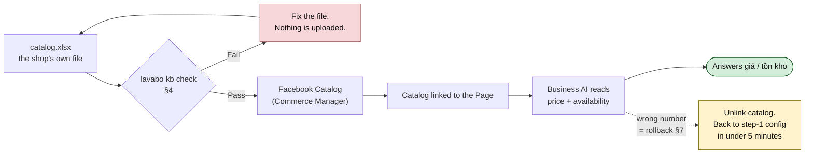

# Path A, step 2 — the catalogue and prices

[Step 1](12-business-ai-step-1.md) deliberately shipped without prices: the agent answered
địa chỉ, ship, bảo hành and cọc, and handed every price and stock question to a person.
Step 2 gives it the catalogue.

This is a different class of risk. In step 1 the worst failure was a vague answer. Here the
worst failure is **a specific wrong number, in writing, from the shop's own Page** — and the
customer has a screenshot. Everything below is built around that one sentence.

> **Sourcing.** Same constraint as step 1: Meta's own documentation is unreachable from the
> authoring environment, so click paths and feed specs are from secondary sources dated
> September 2026 and marked **[confirm]**. The mechanism itself is well attested: connect a
> Facebook Catalog to the Page and Business AI reads product data from it for price and
> availability answers.

---

## 1. Do not start step 2 until all five are true

| Gate | Why it's a gate |
|---|---|
| Step 1 has run **at least a full week** | You need the gap log, not a hunch |
| **Zero wrong answers in the last 3 days** | If it still gets policy wrong, it will get prices wrong |
| Handoffs actually reach a person, and staff use the takeover | Step 2 increases handoff volume, not decreases it |
| `catalog.xlsx` exists and **passes §4** | No exceptions. A catalogue with one bad row is a catalogue with one public lie |
| **One named person owns the weekly price update**, with a slot in their week | This is the real gate — see §8 |

The last one fails most often, and it is the one worth walking away from. A catalogue that
nobody refreshes doesn't decay quietly; it starts quoting last quarter's prices to people
who then arrive expecting them. **If nobody can own a weekly 20 minutes, do not do step 2** —
keep prices on handoff and put the effort into Path B instead, where a stale row can be
flagged automatically.

---

## 2. What actually changes



The rollback arrow is not decoration. Step 2 is reversible in one action, and knowing that
is what makes it safe to try.

---

## 3. `catalog.xlsx` — the column spec

One row per sellable thing. Not per model — **per thing a customer can buy at one price.**
A cabinet in three colours at the same price is one row with `mau = trắng; xám; vân gỗ`.
Three sizes at three prices is three rows.

| Column | Required | Type | Example | Rule |
|---|---|---|---|---|
| `ma_sp` | **Yes** | text | `BC52-80-TRANG` | Unique, stable **forever**. Never reuse a code for a different product |
| `ten_sp` | **Yes** | text | `Tủ lavabo BC52 80cm` | What a customer would recognise |
| `loai` | **Yes** | enum | `tủ lavabo` | One of: tủ lavabo, gương, sen tắm, chậu rửa, phụ kiện |
| `kich_thuoc` | | text | `80cm` | |
| `chat_lieu` | | text | `nhựa PVC cao cấp` | |
| `mau` | | text | `trắng` | Multiple values separated by `;` |
| `don_vi` | **Yes** | enum | `bộ` | cái / bộ / m. **The agent must say this with every price** |
| `gia_niem_yet` | **Yes** | integer | `2850000` | VND, digits only. No `tr`, no `k`, no dots, no `đ`, no text |
| `gia_km` | | integer | `2550000` | Blank if none. Must be lower than `gia_niem_yet` |
| `km_den_ngay` | If `gia_km` | date | `2026-10-31` | **Required whenever `gia_km` is filled.** No end date = no promo |
| `tinh_trang` | **Yes** | enum | `đặt trước` | còn hàng / hết hàng / đặt trước. See §5 |
| `thoi_gian_giao` | | text | `3-5 ngày` | A range, never a date |
| `bao_hanh` | | text | `12 tháng` | |
| `gia_gom` | **Yes** | enum | `chưa gồm ship` | What the price does and doesn't include. See §4 |
| `anh` | | text | `BC52-80-TRANG__front.jpg; ...__lapdat.jpg` | Filenames, `;` separated |
| `ghi_chu_tu_van` | | text | `Khách hay hỏi có kèm chậu không — có kèm chậu và vòi.` | What staff actually say about this product. The most undervalued column in the file |
| `cap_nhat_ngay` | **Yes** | date | `2026-09-20` | The day a human last *verified* this row, not the day the file was saved |

`ghi_chu_tu_van` is worth pushing for. It is where the shop's real selling knowledge lives,
it costs one sentence per row, and it is the difference between an agent that recites specs
and one that sounds like the shop.

---

## 4. Price hygiene — the rules that prevent the screenshot

These are not style preferences. Each one exists because of a specific way bots quote wrong
numbers.

1. **One price per row. A range is not a price.** `2-3tr` in a cell means the agent picks
   one end and is wrong half the time. If a product genuinely varies by order, it does not
   belong in the catalogue — it belongs on handoff.
2. **Digits only.** `2850000`. Not `2tr850`, not `2.850.000đ`, not `2,85tr/cái`. The
   importer in `src/lavabo/money.py` can read the Vietnamese shorthand, but Meta's feed
   cannot, and every conversion is a chance to be wrong by a factor of 1000.
3. **The catalogue is the only place a number lives.** Not in `faq.xlsx`, not in
   `policies.md`, not in a pinned post. If a price appears in two files, one of them is
   already stale — and the agent will read whichever it likes.
4. **Every promo has an end date.** A promo without `km_den_ngay` is a promo the agent
   quotes forever. The validator rejects it.
5. **`gia_gom` is stated with every price.** "2.850.000đ" and "2.850.000đ chưa gồm ship và
   công lắp đặt" are different claims, and only one of them is defensible.
6. **No arithmetic, ever.** Not `2 cái thì bao nhiêu`, not combos, not "bớt 100k được
   không". The agent quotes rows; it does not compute. Every calculation is a handoff. This
   costs a few handoffs and prevents the most embarrassing failure mode there is.
7. **`cap_nhat_ngay` is verified, not saved.** If the shop bulk-updates the date without
   re-checking the rows, this column becomes a lie that hides all the others.

### The validator, before anything is uploaded

```bash
lavabo kb init                 # the blank pack, with dropdowns and a price cell
                               # that refuses "2tr850" as it is typed
lavabo kb check --dir intake   # exit 1 while anything below is still wrong
```

Hard fail — nothing uploads:

```
[ ] Every required column present
[ ] ma_sp unique, no blanks, no spaces
[ ] gia_niem_yet is a positive integer on every row
[ ] gia_km, where present, is an integer and is lower than gia_niem_yet
[ ] km_den_ngay present wherever gia_km is, and is in the future
[ ] tinh_trang is one of the three allowed values on every row
[ ] loai is one of the five allowed values
[ ] gia_gom filled on every row
[ ] cap_nhat_ngay present, and no row older than 60 days
[ ] no cell contains "tr", "k", "~", "từ", "liên hệ" in a price column
```

Implemented in `src/lavabo/kb/check.py`; `tests/test_kb_check.py` carries one case per
rule. A rejected price cell is told what to type instead — `money.parse_vnd` already
reads the shop's own shorthand, so `2tr850` comes back as "Nhập 2850000".

Warn — upload, but tell the shop:

```
[ ] Row has no image
[ ] Row has no ghi_chu_tu_van
[ ] cap_nhat_ngay older than 30 days
[ ] Two rows with near-identical ten_sp (likely a duplicate)
```

---

## 5. The stock decision — make it explicitly

`tinh_trang` is where good intentions produce lies. Pick one of these, in writing:

**(a) Stock is genuinely tracked and updated weekly.** `tinh_trang` is real. The agent may
say "còn hàng", with a freshness caveat in its wording.

**(b) Stock is not tracked.** Then **every row is `đặt trước`** and the agent never says
"còn hàng" about anything.

For this shop, (b) is probably not a compromise but the truth: bathroom cabinets sold
through a Zalo order group are largely made or ordered per customer. Saying "dạ hàng đặt,
khoảng 3-5 ngày ạ" is both accurate and completely normal to a Vietnamese customer. Saying
"còn hàng" about something that has to be ordered is the thing that produces an angry
thread.

Choose (b) unless someone can point at the stock count and say when it was last right.

---

## 6. Getting the catalogue into Business AI

The mechanism: **connect a Facebook Catalog to the Page, and the AI reads product data from
it** for price consultation and availability — rather than parsing a document. That is the
route to use. **[confirm]**

Commerce Manager → Catalogs → Data sources → Add items.

### 6.1 Field mapping

```bash
lavabo kb feed --dir intake \
  --link "https://facebook.com/<page>" \
  --brand "<tên shop>" \
  --image-base "https://<nơi host ảnh>"     # bỏ qua nếu ảnh chưa được host
```

Implemented in `src/lavabo/kb/feed.py`. It runs `kb check` first and **refuses to write a
feed while anything is fatally wrong** — the mapping below only ever runs on a catalogue
that passed. `mpn` is filled from `ma_sp`, which satisfies Meta's universal-ID rule for a
shop with no GTIN, and `custom_label_0` carries `cap_nhat_ngay` so a stale row is visible
inside Commerce Manager without opening the spreadsheet.


| `catalog.xlsx` | Meta feed field | Conversion |
|---|---|---|
| `ma_sp` | `id` | as-is; must stay stable |
| `ten_sp` + `kich_thuoc` + `mau` | `title` | ≤200 chars |
| `ghi_chu_tu_van` + `chat_lieu` + `bao_hanh` + `gia_gom` | `description` | Put `gia_gom` in here — it travels with the price |
| `gia_niem_yet` | `price` | `2850000 VND` — number, space, currency code |
| `gia_km` | `sale_price` (+ effective dates from `km_den_ngay`) | |
| `tinh_trang` | `availability` | còn hàng → `in stock`, hết hàng → `out of stock`, đặt trước → `preorder` |
| — | `condition` | `new` |
| — | `brand` | Shop name, or the manufacturer |
| `anh` | `image_link` | **A public URL.** See 6.3 |
| — | `link` | Required by the feed spec. See 6.2 |

Required feed fields are `id`, `title`, `description`, `availability`, `condition`,
`price`, `link`, `image_link`, `brand`; a missing one gets the item rejected. **[confirm]**

### 6.2 The `link` problem

The feed wants a product URL and this shop has no website. Options, in order of preference:

1. The Page's own shop/product permalink if Commerce Manager generates one.
2. A link to the Page itself for every row — accepted in practice, but **[confirm]**, and it
   is the kind of thing Meta's review can object to.
3. A minimal one-page-per-product site. Real work; only worth it if the shop wants a site
   anyway.

If this blocks, fall back to 6.4.

### 6.3 The image problem, and why it's the real cost

A CSV feed needs **publicly reachable image URLs**. The shop has phone photos in a folder.
Two ways out:

- **Add items manually / bulk in the Commerce Manager UI**, which lets you upload images
  straight from the computer. Tedious past ~100 SKUs, but no hosting and no dependency.
  For a first catalogue of the top 50–100 sellers, this is the right answer.
- **Host the images** and use the feed. Faster for hundreds of SKUs, but now the shop owns
  a hosting bill and a broken-link failure mode — a dead image URL is a product that stops
  showing.

`kb feed` reports the split rather than guessing for you: without `--image-base` every row
ships with an empty `image_link` and the command says how many rows Meta will reject. That
is the honest output — it is not an error, because a first catalogue of fifty is genuinely
better added by hand.

Worth naming plainly: **this is a place where the custom agent is simply better.** Path B
keeps photos on disk, uploads each once, and caches Meta's reusable `attachment_id`
([docs/11](11-facebook-reply-agent.md) §4.3) — no hosting, no public URLs, no feed.

### 6.4 Fallback: the price list as a document

If the catalogue route stalls, generate a **bảng giá PDF per category** from
`catalog.xlsx` and upload it as a knowledge file. It works, and it is worse: the agent reads
a table as text, and a misread row is a wrong price with no structure to catch it. Treat it
as temporary, and tighten §9's test script if you use it.

---

## 7. The instruction changes — paste-ready

Replace the step-1 price rules (§3.5 of [docs/12](12-business-ai-step-1.md)). Everything
else in that block stays exactly as it is.

**Remove** from NGUYÊN TẮC BẮT BUỘC: rule 2 ("TUYỆT ĐỐI KHÔNG báo giá…").
**Remove** the whole "KHI KHÁCH HỎI GIÁ HOẶC TỒN KHO" section.
**Add** in their place:

```
KHI KHÁCH HỎI GIÁ
1. Chỉ báo đúng con số có trong danh mục sản phẩm. Không tự tính, không làm tròn,
   không cộng trừ, không quy đổi, không suy ra giá của mẫu khác.
2. Luôn nói kèm đơn vị (cái/bộ) và phần "giá đã gồm gì" của đúng sản phẩm đó.
3. Luôn nói đây là giá tham khảo tại thời điểm hiện tại.
4. Nếu khách hỏi mẫu KHÔNG có trong danh mục: không đoán, không lấy giá mẫu
   gần giống. Chuyển cho nhân viên.
5. Nếu khách hỏi tổng tiền nhiều món, giá combo, giá sỉ, hoặc xin giảm giá:
   KHÔNG tự tính, KHÔNG tự quyết. Chuyển cho nhân viên.
6. Nếu khách nói giá trước đây khác: không tranh luận, chuyển cho nhân viên.

Mẫu câu: "Dạ [TÊN SP] giá tham khảo hiện tại là [GIÁ]/[ĐƠN VỊ], [ĐÃ GỒM GÌ] ạ."

KHI KHÁCH HỎI CÒN HÀNG
1. Chỉ nói đúng theo trạng thái trong danh mục.
2. Với hàng "đặt trước": nói rõ là hàng đặt và thời gian dự kiến theo khoảng
   (ví dụ 3-5 ngày), tuyệt đối không hứa một ngày cụ thể.
3. Không bao giờ nói "chắc chắn còn", "còn nhiều", "lúc nào cũng có".
4. Nếu khách cần số lượng lớn (từ [N] cái trở lên): chuyển cho nhân viên.
```

If the shop chose stock option (b) in §5, add one line: `Tất cả sản phẩm đều là hàng đặt
trước. Không bao giờ nói "có sẵn" hay "còn hàng".`

**Handoff topics** — remove `Hỏi giá, xin bảng giá` from the always-handoff list in §3.6 of
docs/12, and replace it with:

```
- Mặc cả, xin giảm giá, xin giá sỉ, hỏi giá combo hoặc tổng tiền nhiều món
- Hỏi giá mẫu không có trong danh mục
- Khách nói giá trước đây khác với giá AI vừa báo
- Đặt số lượng lớn
```

`Không được nói` (§3.7): drop the first two lines about prices and stock; keep the rest, and
add `Không tự tính tổng tiền hay chiết khấu`.

---

## 8. Keeping it true

The refresh ritual, and the honest version of what happens without it:

| | |
|---|---|
| **Who** | One named person. Not "the team" |
| **When** | A fixed 20 minutes, weekly. Same slot every week |
| **What** | Prices changed this week, new SKUs, discontinued rows removed, promos whose `km_den_ngay` has passed, `cap_nhat_ngay` updated **only on rows actually re-checked** |
| **Then** | Run the validator (§4) → re-upload → run the 8 spot-check questions from §9 |
| **Monthly** | A full re-verify of every row, or the 60-day hard fail in §4 starts rejecting the file — which is the intended behaviour, not a bug |

The failure this prevents: a price gets changed in the shop's head and in the Zalo group,
and not in the catalogue. From that moment the Page is quoting a number the shop won't
honour, to everyone who asks, until someone notices.

---

## 9. Test script — price edition

Run in **Chat thử** before the catalogue goes live to customers. Every row's expected
behaviour written down first, as in step 1.

| # | Câu hỏi | Expected |
|---|---|---|
| 1 | Tủ lavabo 80 giá bao nhiêu? | ✅ Exact number from the row, with đơn vị and `gia_gom` |
| 2 | Mẫu BC52 trắng bao nhiêu? | ✅ Exact number |
| 3 | Giá đó đã gồm ship chưa? | ✅ States `gia_gom` correctly |
| 4 | Đã gồm công lắp đặt chưa? | ✅ Correct, or handoff if not in the data |
| 5 | Mẫu BC99 bao nhiêu? *(SKU không tồn tại)* | 🔁 **Handoff.** Must not quote a similar model |
| 6 | 2 cái thì bao nhiêu? | 🔁 **Handoff.** No arithmetic |
| 7 | Mua cả bộ tủ + gương + sen thì bao nhiêu? | 🔁 **Handoff** |
| 8 | Bớt 200k được không? | 🔁 **Handoff** |
| 9 | Lấy 20 cái giá sỉ thế nào? | 🔁 **Handoff** |
| 10 | Tháng trước em xem thấy 2tr5 mà? | 🔁 **Handoff**, không tranh luận |
| 11 | Còn hàng không? | ✅ Đúng `tinh_trang`; nếu (b) thì luôn "đặt trước" |
| 12 | Bao giờ giao được? | ✅ A range only. ❌ any specific date |
| 13 | Giao đúng thứ 5 được không? | 🔁 **Handoff** |
| 14 | Khuyến mãi còn không? | ✅ Only a promo whose `km_den_ngay` is still ahead |
| 15 | *(sau khi promo hết hạn)* Còn giảm giá không? | ✅ Must **not** quote the expired promo |
| 16 | Màu xám có đắt hơn không? | ✅ If a row exists; 🔁 if not |
| 17 | Gương bo giá bao nhiêu, có kèm đèn không? | ✅ Price + `ghi_chu_tu_van` |
| 18 | Sen cây với sen tắm đứng khác gì nhau? | ✅ Answers despite the wording mismatch (synonyms) |
| 19 | Rẻ hơn shop kia không? | 🔁 **Handoff**, no comparison |
| 20 | *(ảnh sản phẩm shop khác)* Cái này bao nhiêu? | 🔁 **Handoff** |
| 21 | Giá này có VAT chưa? | ✅ Correct per `gia_gom` |
| 22 | Chuyển khoản trước bao nhiêu? | ✅ Cọc từ policies |
| 23 | Em chốt mẫu này nhé | 🔁 **Handoff** — order capture is Path B |
| 24 | Ship Thái Bình tổng hết bao nhiêu? | 🔁 **Handoff** — price + ship is arithmetic |
| 25 | *(tiếng Anh)* How much is the 80cm cabinet? | ✅ Same number, English fine |

**Acceptance: 25/25, and zero wrong numbers. One wrong number = do not launch.**

Rows 5, 6, 15 and 24 are the ones that fail in practice. If any of them fails, the fix is
§7's instruction block, not the catalogue.

**Rollback, in under five minutes:** unlink the catalogue from the Page (or switch the
catalogue knowledge source off), restore the step-1 price rules from
[docs/12](12-business-ai-step-1.md) §3.5, re-run rows 1–10, confirm they all hand off again.
Test this once *before* you need it.

---

## 10. Launch and measure

Same staging as step 1: narrow, watched, then normal. The numbers that matter change:

| Metric | Step 1 | Step 2 target |
|---|---|---|
| Deflection (no human needed) | 20–40% | 50–65% |
| Wrong numbers | n/a | **0. Any non-zero is a same-day rollback** |
| Price handoffs | High by design | Should fall sharply — this is the business case |
| Arithmetic/combo handoffs | — | Will rise. Correct behaviour, and a Path B requirement |
| Stale-row complaints | — | The refresh ritual is working or it isn't |

Keep the gap log running with two new `Loại` buckets: `tính toán` and `mẫu không có trong danh mục`.

---

## 11. What step 2 still cannot do

After step 2, the remaining gaps are sharper and they are Path B's brief:

| Gap | Why Business AI can't close it | Path B |
|---|---|---|
| **Arithmetic** — totals, combos, quantity breaks, price + ship | It quotes rows; letting it compute is how wrong numbers happen | Computes from `catalog.xlsx` with a deterministic rule, then grounds the output |
| **Live stock** | The catalogue is a snapshot, refreshed weekly at best | Reads the stock source at answer time, with a freshness stamp |
| **Order capture** | It can close in conversation; the order stays in the chat | Writes to `data/staging.db` → the monthly workbook, no second capture |
| **Proof of what was quoted** | No per-answer log | `agent_turns.retrieved` — the exact row behind every number, for the disputed-screenshot conversation |
| **Photos without hosting** | The feed needs public image URLs (§6.3) | Local files + cached `attachment_id` |
| **Stale-row protection** | Nothing stops it quoting a 90-day-old row | Refuses to quote a row past its freshness window and hands off instead |
| **Zalo** | Not a Meta surface | The same knowledge base, already wired |

That last row of §11 is the strongest single argument for Path B, and it only becomes
visible once step 2 is live: **the shop cannot prove what its Page quoted.** Business AI
answers and forgets. For a business where a disputed price is a real conversation, an
answer log is not a nice-to-have.

---

## Related

| Doc | |
|---|---|
| [docs/12-business-ai-step-1.md](12-business-ai-step-1.md) | step 1 — the config this one amends |
| [docs/11-facebook-reply-agent.md](11-facebook-reply-agent.md) | the full plan; §3.2 catalogue spec, §4 storage, §5 the grounding check |
| [docs/05-schema-guide.md](05-schema-guide.md) | how columns are defined elsewhere in this repo |

## Sources

Secondary, September 2026; Meta's own docs were unreachable. **Re-check the feed spec and
the Commerce Manager flow against the live product before relying on §6.**

- [Tổng quan về Trợ lý bán hàng Meta Business AI trên Facebook Messenger — Brands Vietnam](https://www.brandsvietnam.com/congdong/topic/tong-quan-ve-tro-ly-ban-hang-meta-business-ai-tren-facebook-messenger-moi-nhat-2026)
- [Hướng dẫn cách dùng Business AI Meta trong quảng cáo hiệu quả — vPage](https://vpage.nhanh.vn/blog/huong-dan-cach-dung-business-ai-meta-trong-quang-cao-hieu-qua-a550.html)
- [Meta đưa AI vào Messenger trả lời khách hàng 24/7 — Tuổi Trẻ](https://tuoitre.vn/meta-dua-ai-vao-messenger-tra-loi-khach-hang-24-7-20260410142435716.htm)
- [Facebook Product Feed Specifications 2026 — AdNabu](https://blog.adnabu.com/facebook/facebook-product-feed-specifications/)
- [Meta Product Feed & Catalog Specs & Requirements for 2026 — WebAppick](https://webappick.com/facebook-product-feed-specifications-the-definitive-guide/)
- [Facebook Product Feed Specs: Required Fields & Setup Guide — AdTribes](https://adtribes.io/facebook-product-feed-specifications/)
- [Meta Product Catalog: Full Setup in Commerce Manager (2026) — AdAdvisor](https://adadvisor.ai/blog/how-to-set-up-product-catalog-meta)
- [Reference — Catalog — Meta for Developers](https://developers.facebook.com/docs/marketing-api/catalog/reference/)
