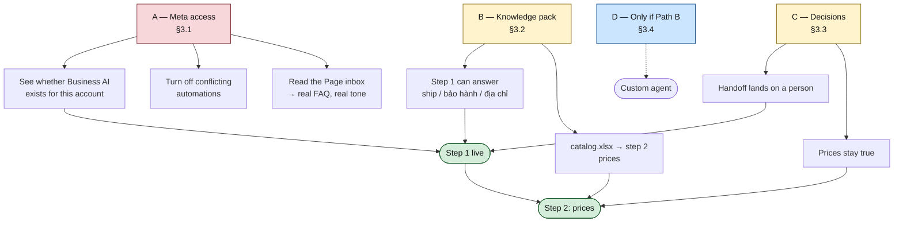

# Current status, and what we need from the customer

Written after an audit of the repo at `6376d8c`. Every status line below is backed by a
command that was actually run, not by memory — §1 shows the output.

The short version: **the Zalo→Excel pipeline is built and tested. Nothing Facebook-related
has ever been connected.** The Meta connector can read conversations in principle and has
never been pointed at a real Page; nothing anywhere in the repo can *send* a message. So
every Facebook item in this document is blocked on access we do not have, and the list in
§3 is what unblocks it.

---

## 1. What the audit found

```
$ lavabo check
schema:     NOT READY — config/schema.yaml not found
timezone:   Asia/Ho_Chi_Minh
FAIL llm:   ANTHROPIC_API_KEY is not set
OK   zalo:  0 file(s) found — WARNING: zalo.own_names is empty
FAIL messenger: page_id/instagram_id not configured

$ staging db: conversations 0, messages 0, extractions 0
```

| Piece | Status | How we know |
|---|---|---|
| Zalo paste → segment → extract → Excel | **Built, 160 tests passing** | `python -m unittest discover -s tests` |
| LLM extraction (Gemini or Claude) | Built; **no API key configured** | `FAIL llm: ANTHROPIC_API_KEY is not set` |
| Intake pack tooling (`lavabo kb init` / `kb check`) | **Built, 26 tests** | added this week |
| Meta **reading** (`ingest --source meta`) | Code written, **never run against a real Page** | `FAIL messenger: page_id not configured`; the connector only ever calls `session.get` |
| Meta **replying** | **Does not exist** | no Send API, no `message_attachments`, no `pass_thread_control` anywhere in `src/` or `scripts/` |
| Knowledge storage (`kb_docs`, `kb_chunks`, `kb_images`, `agent_turns`) | **Proposed only** — [docs/11](11-facebook-reply-agent.md) §4.2 | zero occurrences in `store.py` |
| Business AI (Path A) | Not started; it is customer-side clicking, not code | [docs/12](12-business-ai-step-1.md) |
| Zalo OA webhook | Built but **wire format unverified** — the source says so | `connectors/zalo_oa.py` header |

Note this is the *repository*. If the shop already runs the Zalo pipeline on their own
machine, their `config.yaml` and `.env` live there and are not visible from here — §3.3
asks for that state rather than assuming it.

---

## 2. Two corrections to the earlier plan

Both came out of "we have no Messenger history and no integration", and both change work
that was planned:

1. **The eval set cannot be built from the shop's own history.** [docs/11](11-facebook-reply-agent.md)
   §8 said to pull the 100 most common real questions out of staging. Staging is empty and
   `ingest --source meta` has never authenticated. Until access exists, the test set is the
   scripts in [docs/12](12-business-ai-step-1.md) §4 and [docs/13](13-business-ai-step-2.md)
   §9 plus the three sample conversations the shop writes in `voice.md` — hand-written, not
   mined. Corrected in the docs.
2. **`lavabo kb mine` is off the table for now**, and `kb feed` waits on a filled catalogue.
   Neither is worth building before §3.1 and §3.2 land.

There is also a fork we cannot resolve from here, and it matters:

> **Does the Page already have customer messages in its inbox?**
>
> - **Yes** → Business AI's "Lịch sử trò chuyện" knowledge source has something to learn
>   from, and the shop's real tone comes along for free.
> - **No / very few** → that knowledge source is empty, and **`faq.xlsx` carries the entire
>   load.** The agent will only ever be as good as those 30 rows, and we should ask for 50.
>
> It is question 2 in §3.1, and the answer changes how hard we push on the FAQ file.

---

## 3. What we need from the customer



### 3.1 Meta access — **P0, nothing Facebook moves without this**

| # | What we need | Why | Effort |
|---|---|---|---|
| 1 | **Full-control admin on the Facebook Page** for one named person on our side — or a booked screen-share where the owner clicks and we guide | Everything in [docs/12](12-business-ai-step-1.md) is a settings screen. Editor access is not enough | 10 min |
| 2 | **Answer: does the Page get customer messages today?** Roughly how many a day, and is there history in the inbox? | Decides whether Business AI can learn from past chats — see the fork in §2 | 1 min |
| 3 | **Is the Page inside a Business Portfolio** (Trình quản lý doanh nghiệp)? Which one? | Required for verification and for any API path | 5 min |
| 4 | **Business Verification status** — done / in progress / not started. If not started, **start it today** (GPKD, mã số thuế, địa chỉ, điện thoại) | The only item with an unbounded external clock. Needed for Path B, useful regardless | 30 min + days of waiting |
| 5 | **Is any third-party chatbot connected** to the Page (Abit, vPage/Nhanh, Botcake, AhaChat, Manychat)? | Two automations in one inbox = duplicate replies. It has to be off before we start | 5 min |
| 6 | **Screenshot of** Hộp thư → Tự động hóa | Tells us in one image whether Business AI is available for this account, which decides Path A vs Path B | 2 min |

### 3.2 The knowledge pack — **P0, this is the shop's homework**

Send them the folder produced by `lavabo kb init`. It is a set of forms now, not a blank
page: dropdowns on every list column, a comment on every header, an instructions sheet, and
a price cell that rejects `2tr850` as it is typed.

| File | Priority | Notes |
|---|---|---|
| `store.md` | **P0** | 10 minutes. Địa chỉ, giờ, hotline |
| `policies.md` | **P0** | Cọc, bảo hành, đổi trả, lắp đặt |
| `shipping.xlsx` | **P0** | One row per province they actually ship to |
| `faq.xlsx` | **P0** | 30 rows minimum — **50 if the answer to §3.1 #2 is "no history"** |
| `voice.md` | **P0** | Including the three sample conversations, written by whoever answers messages today |
| `dont_say.md` | P1 | |
| `catalog.xlsx` | **P1 — gates step 2 entirely** | The big one. Top 50 sellers is enough to start |
| Ảnh sản phẩm | P1 | One per SKU, named `<mã SP>__front.jpg` |
| `synonyms.xlsx`, `promotions.xlsx`, `images.xlsx` | P2 | Optional |

They send it back; we run `lavabo kb check --dir intake` and it either passes or says
exactly which row is wrong.

### 3.3 Decisions only the owner can make — **P1, before go-live**

| # | Decision | Consequence of not deciding |
|---|---|---|
| 7 | **Who is the escalation person**, and what hours? | Handoffs land nowhere, which is worse than no agent |
| 8 | **Is stock tracked, honestly?** ([docs/13](13-business-ai-step-2.md) §5 option a or b) | The agent says "còn hàng" about things that have to be ordered |
| 9 | **Who owns the weekly 20-minute price refresh?** | Without a name, **do not do step 2 at all** — a catalogue nobody refreshes quotes last quarter to everyone |
| 10 | **Privacy policy URL** — exists, or needs writing? | Blocks App Review later; harmless to sort now |
| 11 | **Is the Zalo→Excel pipeline already running on a shop machine?** If so: which machine, is `config.yaml` filled in, whose Gemini key? | We may be about to duplicate something that already works |

### 3.4 Only if we go to Path B — **P2, do not collect yet**

Listed so nobody is surprised later: a Meta Business app + Messenger product, a long-lived
Page token (`META_PAGE_TOKEN`), the app secret for webhook signatures, App Review for
`pages_messaging` Advanced Access, and a machine that is awake 24/7 (the shop's PC behind a
tunnel, or ~5 USD/month for a small server). **None of this is needed for Path A**, and
asking for it now only slows the part that can start this week.

---

## 4. What we do *not* need from them

- Any technical work. Everything in §3.2 is Excel, photos and a text file.
- A website.
- Their Zalo group history — that pipeline is separate and already works.
- Product data in any particular system. A messy price list is fine; `kb check` will say
  what to fix.

---

## 5. The order

1. **Today:** §3.1 items 1–6, and start Business Verification (#4).
2. **Today:** `lavabo kb init`, send the folder with §3.2's priority list attached.
3. **When the screenshot arrives:** the Path A / Path B fork resolves, and
   [docs/12](12-business-ai-step-1.md) step 1 becomes a two-hour job.
4. **When `store/policies/shipping/faq/voice` come back and pass `kb check`:** configure
   step 1, run the 20-question script, go live narrow.
5. **When `catalog.xlsx` passes and #9 has a name:** [docs/13](13-business-ai-step-2.md), step 2.

Steps 1 and 2 are independent and both can start today. Everything else waits on them.

---

## Phụ lục — bản gửi cho shop

Copy-paste, in Vietnamese, for the shop directly:

```
Chào anh/chị, để bật trợ lý trả lời tin nhắn Facebook cho shop, bên em cần
mấy thứ sau ạ:

A. QUYỀN TRUY CẬP (làm được ngay hôm nay, ~30 phút)
1. Cấp quyền "Toàn quyền kiểm soát" trang Facebook cho [TÊN/EMAIL], hoặc
   hẹn 30 phút gọi video để anh/chị bấm và bên em hướng dẫn.
2. Cho em hỏi: trang Facebook hiện có khách nhắn tin không ạ? Khoảng bao
   nhiêu tin mỗi ngày, và trong hộp thư đã có tin nhắn cũ chưa?
3. Trang đã nằm trong Trình quản lý doanh nghiệp (Business Manager) chưa ạ?
4. Doanh nghiệp đã xác minh (Business Verification) chưa? Nếu chưa thì nên
   bắt đầu hôm nay — khâu này Meta duyệt lâu, cần giấy phép kinh doanh,
   mã số thuế, địa chỉ, số điện thoại.
5. Trang đang kết nối phần mềm chatbot nào không (Abit, Nhanh/vPage,
   Botcake, AhaChat...)? Nếu có thì cần tắt trước, không thì hai con bot
   sẽ trả lời chồng lên nhau.
6. Anh/chị chụp giúp em màn hình: Meta Business Suite → Hộp thư → Tự động hóa.

B. THÔNG TIN ĐỂ AI TRẢ LỜI ĐÚNG (quan trọng nhất)
Em gửi kèm thư mục biểu mẫu, anh/chị điền vào:
  - store.md       thông tin cửa hàng            (bắt buộc, 10 phút)
  - policies.md    cọc, bảo hành, đổi trả        (bắt buộc)
  - shipping.xlsx  phí ship theo tỉnh            (bắt buộc)
  - faq.xlsx       30-50 câu khách hay hỏi       (bắt buộc, quan trọng nhất)
  - voice.md       cách shop xưng hô + 3 hội thoại mẫu (bắt buộc)
  - catalog.xlsx   bảng giá sản phẩm             (làm sau cũng được, nhưng
                   chưa có file này thì AI chưa được phép báo giá)
  - ảnh sản phẩm   đặt tên theo mã sản phẩm

C. BA QUYẾT ĐỊNH CỦA ANH/CHỊ
7. Ai là người nhận các tin nhắn AI chuyển sang, và trong khung giờ nào?
8. Shop có đếm tồn kho thật không? Nếu không, tất cả sản phẩm sẽ để
   "đặt trước" — đúng hơn và an toàn hơn.
9. Ai là người cập nhật lại bảng giá mỗi tuần (khoảng 20 phút)? Nếu chưa
   có ai nhận việc này thì bên em khuyên CHƯA nên cho AI báo giá.

Riêng mục B, anh/chị cứ điền được đến đâu gửi đến đó — em kiểm tra file
bằng công cụ và sẽ báo lại chính xác dòng nào cần sửa ạ.
```

---

## Related

| Doc | |
|---|---|
| [docs/11-facebook-reply-agent.md](11-facebook-reply-agent.md) | the full plan and the intake spec |
| [docs/12-business-ai-step-1.md](12-business-ai-step-1.md) | step 1 — what the access in §3.1 unlocks |
| [docs/13-business-ai-step-2.md](13-business-ai-step-2.md) | step 2 — what `catalog.xlsx` unlocks |
| [docs/04-meta-setup.md](04-meta-setup.md) | the Path B token and permission work in §3.4 |
