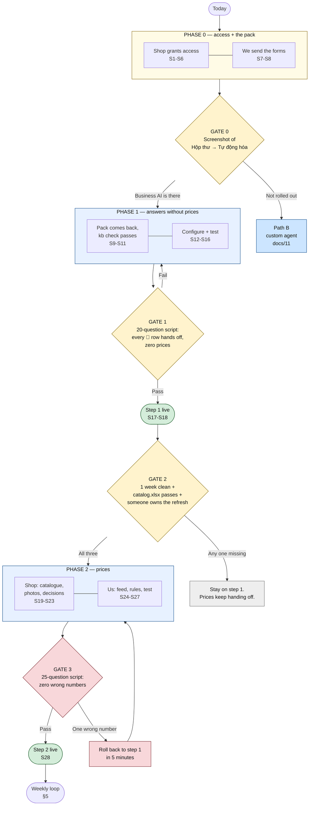
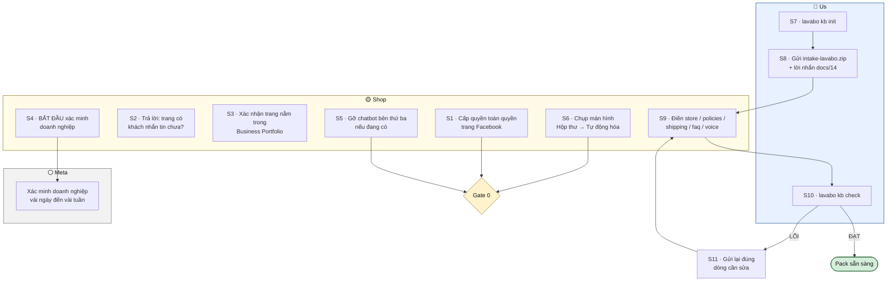
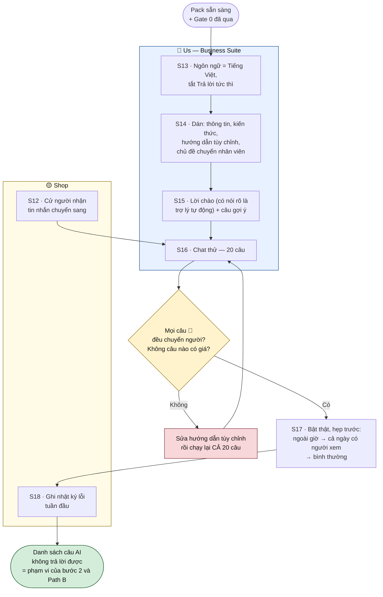
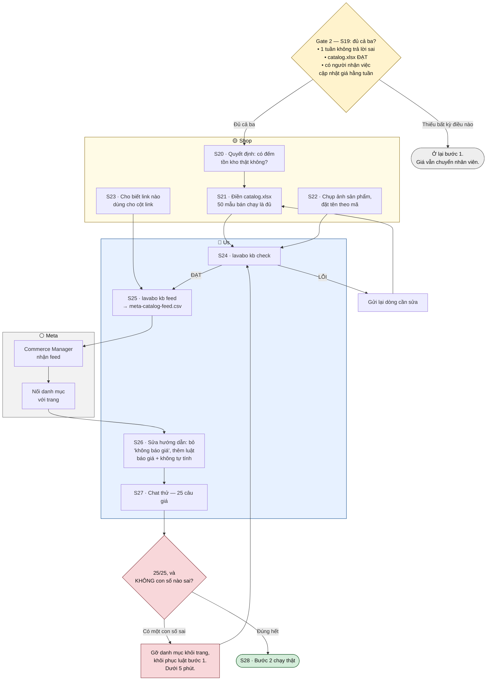
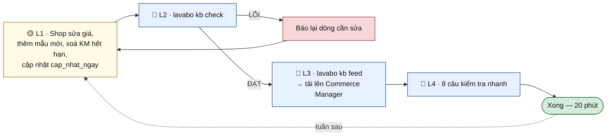

# End-to-end flow — every step, and whose step it is

One place to see the whole path from today to an agent answering price questions, with
each step attributed. Steps are numbered `S1`–`S28` and the table in §6 lists every one
with its owner, effort, and what it blocks.

The three actors, colour-coded in every diagram below:

| | Actor | Does |
|---|---|---|
| 🟡 | **Shop** (khách hàng) | Grants access, writes the knowledge pack, makes the business decisions |
| 🔵 | **Us** | Runs the tooling, configures Business Suite, tests, measures |
| ⚪ | **Meta** | Verification, rollout, catalogue ingestion — mostly waiting |

Nothing here is a schedule. It is a dependency order: **§6's "blocks" column is the real
content**, and the diagrams are the same information drawn.

---

## 1. Overview — four phases and the gate that ends each

**Gate 3 is the only one that can send you backwards after going live**, and it is
deliberately harsh: one wrong number rolls the catalogue back out.

---

## 2. Phase 0 — access and the pack

Both columns start today and neither waits on the other.

**S4 is the one to start today even though nothing needs it yet** — it is the only step
with an unbounded external clock, and Path B is unreachable without it.

**S5 is the one people skip.** A third-party chatbot still connected means two automations
in one inbox, replying over each other.

---

## 3. Phase 1 — the agent answers, without prices

Phase 1's real output is not a running bot — it is **the gap log**. That list is what
decides whether phase 2 is worth doing and what Path B gets built for.

---

## 4. Phase 2 — prices

**S20 changes what the agent is allowed to say.** No real stock count means every row is
`đặt trước` and the agent never says "còn hàng" — which for made-to-order bathroom
furniture is usually the truth, not a compromise.

---

## 5. After go-live — the weekly loop

`kb feed` is not a milestone you pass once. It is this:

A skipped week is not silent: `cap_nhat_ngay` ages, and at 60 days `kb check` starts
rejecting the file — which is the intended behaviour, not a bug. The Page quoting a price
nobody has verified this quarter is the thing that ritual exists to prevent.

---

## 6. Every step, with its owner

| # | Step | Who | Effort | Blocks |
|---|---|---|---|---|
| **S1** | Full-control admin on the Page | 🟡 Shop | 10 min | Everything Facebook |
| **S2** | Answer: does the Page get messages? Is there inbox history? | 🟡 Shop | 1 min | How hard we push on `faq.xlsx` |
| **S3** | Confirm the Page is in a Business Portfolio | 🟡 Shop | 5 min | S4 |
| **S4** | **Start Business Verification** | 🟡 Shop | 30 min + weeks of waiting | Path B; start today regardless |
| **S5** | Disconnect any third-party chatbot | 🟡 Shop | 5 min | S17 — two bots in one inbox |
| **S6** | Screenshot of Hộp thư → Tự động hóa | 🟡 Shop | 2 min | **Gate 0** — Path A vs Path B |
| **S7** | `lavabo kb init` | 🔵 Us | 1 min | S8 |
| **S8** | Send `intake-lavabo.zip` + the docs/14 message | 🔵 Us | 5 min | S9 |
| **S9** | Fill `store` / `policies` / `shipping` / `faq` / `voice` | 🟡 Shop | **half a day** | Step 1 entirely |
| **S10** | `lavabo kb check` | 🔵 Us | 1 min | S14 |
| **S11** | Send back the exact rows to fix | 🔵 Us | 5 min | loops to S9 |
| **S12** | **Name the escalation person** and their hours | 🟡 Shop | 5 min | S16 — handoffs need somewhere to land |
| **S13** | Language = Tiếng Việt, Trả lời tức thì off | 🔵 Us | 10 min | S14 |
| **S14** | Paste business info, knowledge, instructions, handoff topics | 🔵 Us | 45 min | S16 |
| **S15** | Greeting with the AI disclosure + ice breakers | 🔵 Us | 15 min | S16 |
| **S16** | Chat thử — the 20-question script | 🔵 Us | 30 min | **Gate 1** |
| **S17** | Go live, narrowly: after-hours → watched → normal | 🔵 Us | 1 week | S18 |
| **S18** | Keep the gap log for a week | 🟡 Shop + 🔵 Us | 5 min/day | **Gate 2**; scope of phase 2 and Path B |
| **S19** | **Name the weekly price owner** | 🟡 Shop | 5 min | **Gate 2 — no name, no phase 2** |
| **S20** | Decide: is stock genuinely tracked? | 🟡 Shop | 10 min | S21 — what the agent may claim |
| **S21** | Fill `catalog.xlsx` | 🟡 Shop | **1–2 days** | **Phase 2 entirely** |
| **S22** | Photograph products, name by SKU | 🟡 Shop | 1 day | Image answers |
| **S23** | Decide what goes in the `link` column | 🟡 Shop | 10 min | S25 |
| **S24** | `lavabo kb check` on the catalogue | 🔵 Us | 1 min | S25 |
| **S25** | `lavabo kb feed` → CSV → Commerce Manager → link to Page | 🔵 Us | 1 hour | S26 |
| **S26** | Rewrite the price rules (docs/13 §7) | 🔵 Us | 30 min | S27 |
| **S27** | Chat thử — the 25-question price script | 🔵 Us | 45 min | **Gate 3** |
| **S28** | Step 2 live | 🔵 Us | — | The weekly loop |

Shop time totals roughly **2–3 days spread over a fortnight**, almost all of it S9, S21 and
S22. Everything else on their side is minutes.

---

## 7. Where Path B enters

Path B is not a later phase of this flow — it is a different build, and the gap log from
S18 plus the handoffs from S28 are what justify it. It becomes the answer when:

- **Gate 0 fails** — Business AI isn't enabled for this account, so there is no Path A.
- **The gap log fills with arithmetic** — totals, combos, price + ship. Business AI quotes
  rows; it must not compute, and docs/13 §7 forbids it.
- **Orders need capturing** into `data/staging.db` and the monthly workbook.
- **A quote is disputed** and nobody can prove what the Page said. Business AI answers and
  forgets; `agent_turns.retrieved` is the reason Path B exists at all.

[docs/11](11-facebook-reply-agent.md) is the build; [docs/14](14-what-we-need-from-the-customer.md)
§3.4 is what it would then need from the shop.

---

## Related

| Doc | |
|---|---|
| [docs/14-what-we-need-from-the-customer.md](14-what-we-need-from-the-customer.md) | audited status and the request list — S1–S11 in prose |
| [docs/12-business-ai-step-1.md](12-business-ai-step-1.md) | S13–S18 click by click, with the 20-question script |
| [docs/13-business-ai-step-2.md](13-business-ai-step-2.md) | S19–S28, the column spec and the 25-question script |
| [docs/11-facebook-reply-agent.md](11-facebook-reply-agent.md) | §7 — the Path B build |
