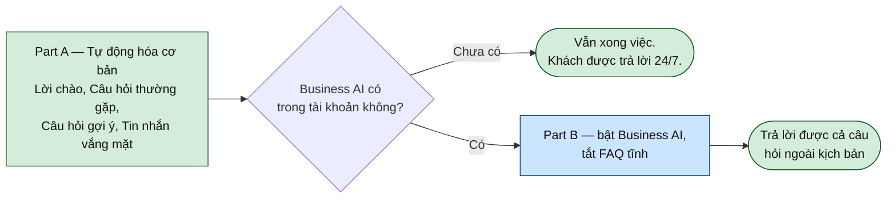

# Quick setup — basic auto-replies today

Path A, minus the waiting. This gets the Page answering the six questions customers ask
most, **using facts you can collect in a ten-minute phone call** — no intake pack, no
catalogue, no App Review.

Budget: **10 minutes on the phone with the shop, 40 minutes clicking.**

> The full version is [docs/12](12-business-ai-step-1.md). This is the cut that fits in an
> afternoon. Everything configured here survives into the full version — none of it is
> throwaway.

> **Labels are approximate.** Meta's own docs and every Vietnamese how-to site are blocked
> from the environment this was written in, so panel names come from secondary sources
> (Sept 2026) and are marked **[confirm]** where they matter. Where a label is uncertain
> the step says what to look *for*.

---

## 0. The order that matters: deterministic before generative

Two layers are available, and doing them in this order is the whole point of this document.



**Part A answers are typed by you.** They cannot be wrong, cannot invent a price, and work
on every Page regardless of what Meta has rolled out. That is worth more on day one than a
clever agent, and if Business AI never arrives for this account, Part A is still a real
improvement over silence.

**Part B is optional today.** Add it once Part A is live and you have seen what customers
actually ask.

### What this does NOT get you

- Answering anything outside the six scripted questions (Part A) — those go to a human.
- Any price or stock answer. Still handed off; see [docs/13](13-business-ai-step-2.md).
- A knowledge base. The intake pack is still the thing that makes the agent good.

---

## 1. The ten-minute call — eight facts

Ask these, write the answers straight into §3's blocks. Nothing else is needed today.

```
1. Tên shop ghi trên Facebook là gì ạ?
2. Địa chỉ cửa hàng? Giờ mở cửa?
3. Số hotline và Zalo để khách gọi?
4. Shop có ship toàn quốc không? Phí ship tính thế nào?
   (chỉ cần câu trả lời chung — "tuỳ tỉnh, khoảng 100-200k, bên em báo sau khi chốt")
5. Bảo hành bao lâu? Bảo hành những gì?
6. Đặt cọc bao nhiêu phần trăm?
7. Nhân viên trả lời tin nhắn trong khung giờ nào?
8. Ai là người nhận tin nhắn khi AI chuyển sang? (cần một cái tên cụ thể)
```

Fact 8 is the one that is not optional. An automated reply that promises a human, with no
human behind it, is worse than no automation.

---

## 2. Pre-flight — 10 minutes

### Đường dẫn nhanh

| Màn hình | Link |
|---|---|
| Người dùng — thêm người | <https://business.facebook.com/settings/people> |
| **Trang — gán tài sản + phân quyền** | <https://business.facebook.com/settings/pages> |
| Hộp thư | <https://business.facebook.com/latest/inbox> |
| **Tự động hóa** | <https://business.facebook.com/latest/inbox/automations> |
| Thông tin doanh nghiệp | <https://business.facebook.com/settings/info> |
| Trung tâm bảo mật — 2FA, xác minh doanh nghiệp | <https://business.facebook.com/settings/security_center> |
| Commerce Manager — danh mục sản phẩm (bước 2) | <https://business.facebook.com/commerce> |

Nếu link mở nhầm doanh nghiệp khác, thêm `?business_id=<id>` — id nằm trong URL khi đã vào
đúng portfolio. **[confirm]** Các đường dẫn này theo mẫu URL ổn định lâu nay, không mở
được từ môi trường viết tài liệu này để kiểm chứng.


| # | Check | Where | If it fails |
|---|---|---|---|
| 1 | You have **Toàn quyền kiểm soát** on the Page | [/settings/pages](https://business.facebook.com/settings/pages) — the Page asset, not just [/settings/people](https://business.facebook.com/settings/people) | Nothing below is possible at Editor level |
| 2 | **No third-party chatbot is connected** | [/settings/business_apps](https://business.facebook.com/settings/business_apps) hoặc Cài đặt → Ứng dụng | Disconnect Abit / vPage / Botcake / AhaChat / Manychat first, or two bots reply over each other |
| 3 | Page **address, hours and phone are filled in** | [/settings/info](https://business.facebook.com/settings/info) | Fill them. Both the FAQ automation and Business AI read this, and it is the answer to the single most common question |
| 4 | Note whether **Business AI** appears | [/latest/inbox/automations](https://business.facebook.com/latest/inbox/automations) | Absent is fine — do Part A only |

Check 2 is the one that gets skipped and then costs an afternoon of confusion.

---

## 3. Part A — the automations everyone has

**[Hộp thư → Tự động hóa](https://business.facebook.com/latest/inbox/automations).** Fill the `[...]` from §1 before pasting. **[confirm]** the exact
panel names as you go.

### 3.1 Lời chào (Greeting)

Shown before the customer's first message.

```
Dạ [TÊN SHOP] xin chào anh/chị 👋
Shop chuyên tủ lavabo, gương, sen tắm và thiết bị vệ sinh.
Anh/chị cần hỏi gì cứ nhắn ạ, hoặc bấm vào câu hỏi bên dưới.
```

### 3.2 Trả lời tức thì (Instant reply)

Fires on the customer's first message.

> **This is the setting my earlier guidance gets wrong out of context.** Turn it **ON** now,
> while Part A is the only automation. If you later switch Business AI on (Part B), turn it
> **OFF** — otherwise every customer gets a canned line and an AI reply one second apart.

```
Dạ [TÊN SHOP] đã nhận được tin nhắn của anh/chị ạ 🙏
Anh/chị bấm vào các câu hỏi gợi ý để xem thông tin ngay,
hoặc để lại câu hỏi — bạn phụ trách sẽ trả lời trong [GIỜ LÀM VIỆC] ạ.
```

### 3.3 Câu hỏi thường gặp (FAQs) — the load-bearing one

Tappable questions with answers you typed. This is what actually deflects messages. Add as
many as the panel allows — historically a handful; it will tell you. **[confirm]**

**Q1 — Shop ở đâu? Mấy giờ mở cửa?**
```
Dạ shop ở [ĐỊA CHỈ] ạ.
Mở cửa [GIỜ MỞ CỬA]. Anh/chị qua trực tiếp xem hàng được ạ.
Hotline: [HOTLINE]
```

**Q2 — Có ship về tỉnh không? Phí bao nhiêu?**
```
Dạ shop ship [KHU VỰC GIAO] ạ.
Phí ship tuỳ tỉnh và kích thước hàng, [CÁCH TÍNH PHÍ SHIP].
Anh/chị cho em xin địa chỉ, bạn phụ trách báo phí chính xác ngay ạ.
```

**Q3 — Bảo hành thế nào?**
```
Dạ bảo hành [THỜI GIAN BẢO HÀNH] ạ, áp dụng cho [BẢO HÀNH NHỮNG GÌ].
Cần bảo hành anh/chị gọi [HOTLINE] hoặc nhắn Zalo [ZALO], bên em xử lý ạ.
```

**Q4 — Đặt hàng thế nào? Cọc bao nhiêu?**
```
Dạ anh/chị chọn mẫu rồi nhắn cho em mã hoặc ảnh sản phẩm ạ.
Đặt cọc [MỨC CỌC], phần còn lại thanh toán khi nhận hàng.
Anh/chị để lại số điện thoại, bạn phụ trách gọi xác nhận ngay ạ.
```

**Q5 — Giá bao nhiêu?**

The one that matters most, and the answer is deliberately not a number:
```
Dạ mỗi mẫu một giá khác nhau ạ. Anh/chị cho em xin ảnh hoặc tên mẫu
đang quan tâm, bạn phụ trách báo giá chính xác trong [GIỜ LÀM VIỆC] ạ.
Hoặc gọi [HOTLINE] để được báo giá ngay.
```

**Q6 — Em muốn gặp nhân viên tư vấn**
```
Dạ em chuyển cho bạn phụ trách ngay ạ.
Trong [GIỜ LÀM VIỆC] bên em trả lời trong ít phút.
Gấp thì anh/chị gọi [HOTLINE] giúp em ạ.
```

### 3.4 Câu hỏi gợi ý (Ice breakers) — pick 4

**Four is the cap.** **[confirm]** Choose the four that steer customers into Q1–Q6 above:

```
Shop ở đâu ạ?
Phí ship về tỉnh bao nhiêu?
Bảo hành thế nào?
Em muốn gặp nhân viên tư vấn
```

### 3.5 Tin nhắn vắng mặt (Away message)

Set business hours to `[GIỜ LÀM VIỆC]` so this fires outside them.

```
Dạ ngoài giờ làm việc, em đã ghi nhận tin nhắn của anh/chị ạ.
Bạn phụ trách sẽ liên hệ lại ngay đầu giờ [GIỜ LÀM VIỆC].
Gấp thì anh/chị gọi [HOTLINE] giúp em ạ.
```

**Do not promise a callback the shop will not make.** Whatever goes here, fact 8's named
person has to honour it, and per [docs/12](12-business-ai-step-1.md) §6 the 24-hour
messaging window means "we'll get back to you" past tomorrow may be a promise Meta will not
let them keep.

---

## 4. Part B — Business AI, only if it is there

Skip entirely if step 2.4 found nothing. If it is there and you want it live today:

1. **Ngôn ngữ: Tiếng Việt.** Re-check it after every other change.
2. **Nguồn kiến thức:** turn on Lịch sử trò chuyện and Nội dung trang. Leave the product
   catalogue **off** — [docs/13](13-business-ai-step-2.md) §1 explains why prices wait.
3. **Hướng dẫn tùy chỉnh:** paste the block from [docs/12](12-business-ai-step-1.md) §3.5
   verbatim. It is the guardrail: never quote a price, never claim stock, hand off when
   unsure.
4. **Chủ đề chuyển nhân viên:** the list in [docs/12](12-business-ai-step-1.md) §3.6.
5. **Turn Trả lời tức thì OFF** (§3.2) and **turn the static FAQ off or trim it** — two
   layers answering the same question is how a Page ends up contradicting itself.

---

## 5. Test before a customer sees it

Message the Page from a personal account (or use **Chat thử** if Business AI is on). Ten
questions, expected behaviour written down first:

| # | Gửi | Mong đợi |
|---|---|---|
| 1 | *(mở chat lần đầu)* | Lời chào + 4 câu hỏi gợi ý hiện ra |
| 2 | Bấm "Shop ở đâu ạ?" | Đúng địa chỉ và giờ |
| 3 | Bấm "Phí ship về tỉnh bao nhiêu?" | Câu trả lời chung + xin địa chỉ |
| 4 | "tủ 80 bao nhiêu tiền?" | **Không có con số nào**, chuyển người |
| 5 | "còn hàng không?" | Không khẳng định còn/hết |
| 6 | "bảo hành mấy năm?" | Đúng chính sách |
| 7 | "cọc bao nhiêu?" | Đúng mức cọc |
| 8 | "em muốn gặp người thật" | Chuyển ngay, có nhắc hotline |
| 9 | *(nhắn ngoài giờ)* | Tin nhắn vắng mặt, đúng giờ làm việc |
| 10 | *(nhắn 2 tin liên tiếp)* | Không bị trả lời trùng lặp 2-3 lần |

**Row 4 is the blocker.** If any reply contains a price, fix it before going live — that is
the failure that costs a customer rather than annoying one.

Row 10 is what catches Trả lời tức thì fighting with Business AI.

### Turning it off

[Hộp thư → Tự động hóa](https://business.facebook.com/latest/inbox/automations) → tắt từng mục. Know where this is before you need it, and make sure
one other person does too.

---

## 6. Go live, and what to watch

It is already live once saved — there is no separate publish. So:

- **Tell the named person from fact 8** that messages will start arriving tagged for them.
- **Day 1–3:** someone reads every thread. Not to reply faster, but to notice what the
  automation got wrong.
- **Keep a list** of questions customers asked that the six FAQs did not cover. Five
  minutes a day.

That list is the deliverable. It becomes `faq.xlsx` in the real pack, and it is far better
than anything the shop would have written from a blank page — which is also the honest
argument for doing this before collecting the intake pack rather than after.

---

## 7. Then what

| When | Do |
|---|---|
| End of week 1 | Turn the gap list into 10–15 more FAQ entries, or into `faq.xlsx` |
| When the pack arrives | The full [docs/12](12-business-ai-step-1.md) configuration; everything here carries over |
| When `catalog.xlsx` passes | [docs/13](13-business-ai-step-2.md) — prices |
| Whenever | Business Verification, if not started ([docs/14](14-what-we-need-from-the-customer.md) §3.1) |

---

## Related

| Doc | |
|---|---|
| [docs/17-desktop-session-brief.md](17-desktop-session-brief.md) | the same job handed to a Claude session on the shop's machine, instead of clicked by hand |
| [docs/12-business-ai-step-1.md](12-business-ai-step-1.md) | the full step 1 — this is its short form |
| [docs/15-end-to-end-flow.md](15-end-to-end-flow.md) | where this sits: S13–S17, minus the waiting |
| [docs/14-what-we-need-from-the-customer.md](14-what-we-need-from-the-customer.md) | the pack this deliberately skips |

## Sources

Secondary, September 2026; Meta's own documentation was unreachable from the authoring
environment.

- [Facebook Automated Responses — Complete 2026 Guide (NapoleonCat)](https://napoleoncat.com/blog/facebook-automated-responses/)
- [Hướng dẫn cài đặt tự động trả lời tin nhắn Facebook Messenger 2026 — J-Wisdom](https://www.auto-growth.app/vn/blog/tu-dong-tra-loi-tin-nhan-facebook/)
- [Cách chỉnh sửa tin nhắn tự động trên fanpage Facebook — vPage](https://vpage.nhanh.vn/blog/cach-chinh-sua-tin-nhan-tu-dong-tren-fanpage-facebook-don-gian-a384.html)
- [Hướng dẫn thiết lập tự động trả lời tin nhắn trên Fanpage — Quantrimang](https://quantrimang.com/cong-nghe/huong-dan-thiet-lap-tu-dong-tra-loi-tin-nhan-tren-fanpage-facebook-122646)
- [FAQ in Messenger with Ice Breakers — Xerone IT](https://xeroneit.net/blog/messenger-ice-breakers-features-importance-with-xerochat/5)
- [Facebook Messenger Chatbots — Complete Guide 2026](https://chatbotscape.com/channels/messenger-chatbot-guide)
