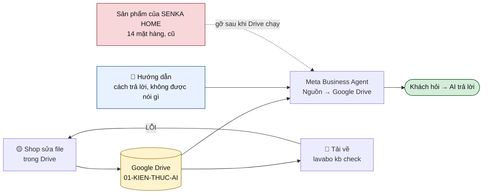

# The Google Drive source — one place the shop edits

Meta Business Agent can connect a **Google Drive** folder as a knowledge source (Nguồn →
Google Drive → Kết nối, on the [Thông tin của bạn](https://business.facebook.com/latest/business_ai/knowledge)
screen). That folder becomes the single place the shop's facts live, which is worth more
than any other decision in this document.

The alternative — keeping *Sản phẩm của SENKA HOME* up to date inside Meta while a
`catalog.xlsx` lives on our side — is the "one fact, one place" rule broken by
construction. Two copies of a price disagree within a month, and the agent answers from
whichever it likes.

---

## 1. The distinction that matters more than the folder layout

**Knowledge is not instructions.** They go in different places, and mixing them is how an
agent ends up reciting internal rules at a customer.

| | Goes in | Contains |
|---|---|---|
| **Kiến thức** (knowledge) | **the Drive folder** | Facts a customer may be told: địa chỉ, giờ, phí ship, bảo hành, cọc, đổi trả, bảng giá, danh sách sản phẩm, FAQ |
| **Hướng dẫn** (instructions) | the agent's **[Hướng dẫn](https://business.facebook.com/latest/business_ai/knowledge)** tab — never Drive | How to behave: xưng hô, độ dài câu trả lời, "không bao giờ báo giá ngoài bảng giá", handoff topics, the dont-say list |

So of the intake pack: `store`, `policies`, `shipping`, `faq`, the price list and the
product list go to Drive. **`voice.md`, `dont_say.md` and `handoff.xlsx` do not** — they are
instructions, and a customer should never see a sentence from them. `lavabo kb publish`
enforces that split rather than leaving it to discipline: it writes only the customer-facing
files and names what it left out and why.



---

## 2. The folder

Two folders, and **only one of them is connected**:

```
SENKA HOME — AI/
├── 01-KIEN-THUC-AI/        ← connected to Meta. Everything here can be said to a customer.
│   ├── 01-thong-tin-cua-hang
│   ├── 02-chinh-sach
│   ├── 03-phi-van-chuyen
│   ├── 04-cau-hoi-thuong-gap
│   └── 05-bang-gia
└── 02-ANH-SAN-PHAM/        ← NOT connected. Photos, per the phone guide.
```

Three rules, and the first one is the whole game:

1. **Only finished, checked files go in `01-KIEN-THUC-AI`.** A Drive folder is a dumping
   ground by nature; this one is published content. Drafts, old versions and "để xem lại"
   files live anywhere else.
2. **One file per topic. No `bang-gia-v2-final`.** Editing beats duplicating — the agent
   would read both and quote either.
3. **Put the date inside the file, not in its name.** A "cập nhật ngày …" line at the top
   of each file is what makes staleness visible, and staleness is the failure mode that
   put a fifteen-week-old Bảng giá in front of this agent already.

**Ownership:** the folder belongs to the **shop's** Google account, not ours. They keep it
when we are gone. Share it with whoever connects it in Meta.

**Format: build for Google Sheets (tables) and Google Docs (prose)** — not because it is
certainly what the connector accepts, but because it is the right answer even if `.xlsx`
also works: the shop edits it more easily, there is nothing to send back, and File →
Download → `.xlsx` hands `lavabo kb check` the exact file it already parses. Anything
broader the connector accepts saves a conversion step, nothing more.

Acceptance is not the only question — a spreadsheet that indexes fine can still be *read*
as a wall of text, and the agent then answers with the row above. [docs/19-drive-format-probe.md](19-drive-format-probe.md) is the
half-hour probe that settles both, and it is step 1 of §4.

---

## 3. What goes in each file

The intake pack already defines these; Drive just changes the container.

| File | From | Note |
|---|---|---|
| `01-thong-tin-cua-hang` | `store.md` | Tên shop, địa chỉ, giờ, hotline, khu vực giao |
| `02-chinh-sach` | `policies.md` | Cọc, bảo hành (kể cả **không** bảo hành gì), đổi trả, lắp đặt |
| `03-phi-van-chuyen` | `shipping.xlsx` | A table, one row per tỉnh — not a paragraph |
| `04-cau-hoi-thuong-gap` | `faq.xlsx` | Real questions, real answers. **No prices here** |
| `05-bang-gia` | `catalog.xlsx` | The only place a number lives. Also feeds **Thêm bảng giá** |

The "no prices in the FAQ" rule survives the move to Drive intact, and matters more here:
the agent reads every file in the folder, so a price in two files is a contradiction it
will happily choose between.

---

## 4. Cutover — the order protects the customer

The agent is currently **AI đang tắt**. Keep it that way until step 6.

1. **Test the connector with one file.** Put `01-thong-tin-cua-hang` in the folder alone,
   connect it, and use **Chat thử** to ask "shop ở đâu?". This answers the format question
   in ten minutes and before anybody retypes a price list.
2. **Add the rest**, price list last.
3. **Audit what is already loaded.** The existing *Sản phẩm của SENKA HOME* (14 mặt hàng)
   and the *Bảng giá* at 15 tuần are knowledge the moment the agent runs. Compare them
   against the new files.
4. **Remove the old entries** once Drive carries the same facts, correctly. Not before —
   and not "leave them, they're probably fine". Two catalogues is the problem this whole
   document exists to avoid.
5. **Hướng dẫn**: paste the guardrails from [docs/12](12-business-ai-step-1.md) §3.5 and the
   handoff topics from §3.6.
6. **Chat thử**, then the toggle. The script is [docs/16](16-quick-setup.md) §5; the row
   that blocks launch is "tủ 80 bao nhiêu tiền?" returning a number when it should not.

**Building the folder:** `lavabo kb publish --dir intake --to drive/` turns a filled,
passing intake pack into exactly this structure — knowledge files with an update date,
photos separate, the form folder separate, and a rules note in the parent rather than in
the connected folder (where the agent would read it as a fact). Upload `01-KIEN-THUC-AI`
and connect **that folder only**.

**Our side, at any point:** download the folder and run `lavabo kb check --dir <folder>`.
It reads the same files and names the rows that are wrong — the Drive move does not cost us
the validator.

---

## 5. Keeping it true

Drive removes the upload step, not the responsibility. The weekly ritual from
[docs/13](13-business-ai-step-2.md) §8 becomes:

| | |
|---|---|
| **Who** | One named person at the shop. Still not "the team" |
| **When** | A fixed 20 minutes, weekly |
| **What** | Edit the file in Drive; update the "cập nhật ngày" line on any row actually re-checked |
| **Then** | We download and run `kb check`; spot-check 8 questions in Chat thử |

The failure this prevents has already happened once here: a price list reached fifteen weeks
old inside a system nobody was looking at. In Drive it is more visible, not less
dangerous — Meta re-reads the folder, so an edit is live without anyone deciding it is.

**[confirm]** how often the connector re-syncs, and whether an edit needs a manual refresh.
Until that is known, treat a price change as **not live** until Chat thử says it is.

---

## 6. Gửi cho shop

```
Anh/chị tạo giúp em một thư mục Google Drive để AI đọc thông tin shop ạ.
Đây sẽ là NƠI DUY NHẤT chứa thông tin — sửa ở đây là AI trả lời theo,
không phải sửa ở nhiều chỗ nữa.

CÁCH LÀM
1. Vào Google Drive, tạo thư mục: SENKA HOME - AI
2. Trong đó tạo 2 thư mục con:
      01-KIEN-THUC-AI      ← thông tin cho AI đọc
      02-ANH-SAN-PHAM      ← ảnh sản phẩm (AI không đọc thư mục này)
3. Trong 01-KIEN-THUC-AI tạo 5 file:
      01-thong-tin-cua-hang     địa chỉ, giờ mở cửa, hotline, khu vực giao
      02-chinh-sach             cọc, bảo hành, đổi trả, lắp đặt
      03-phi-van-chuyen         bảng phí ship theo tỉnh
      04-cau-hoi-thuong-gap     câu khách hay hỏi + câu trả lời
      05-bang-gia               bảng giá sản phẩm
4. Chia sẻ thư mục SENKA HOME - AI cho [EMAIL] với quyền chỉnh sửa.

BA ĐIỀU QUAN TRỌNG
- Chỉ để file đã chốt vào 01-KIEN-THUC-AI. AI đọc TẤT CẢ file trong đó,
  nên file nháp hay file cũ sẽ thành câu trả lời sai cho khách.
- Mỗi nội dung một file. Không để "bang-gia-v2", "bang-gia-moi-nhat" —
  sửa thẳng vào file cũ.
- Đầu mỗi file ghi một dòng "Cập nhật ngày ..." và sửa dòng đó mỗi lần
  kiểm tra lại. Hiện bảng giá đang dùng đã cũ khoảng 15 tuần, đây đúng là
  thứ cần tránh.

Thư mục là của shop, anh/chị giữ toàn quyền. Điền được file nào gửi file
đó, bên em kiểm tra và báo lại chỗ nào cần sửa ạ.
```

---

## 7. Open, and worth settling on screen

1. **Which formats does the connector accept, and does it read a table correctly** —
   [docs/19-drive-format-probe.md](19-drive-format-probe.md) is the probe. Decides whether the intake pack goes in unchanged, and
   whether prices may live in the Drive folder at all.
2. **Re-sync cadence** — automatic, and how fast? Or manual refresh?
3. **Does removing *Sản phẩm của SENKA HOME* break anything else** that references it (a
   shop tab, an ad)? Check before deleting; disabling may be safer than removing.
4. **Does Thêm bảng giá want the same file** as the Drive price list, or is it a separate
   upload? If separate, that is a second copy — and §1's rule says pick one.

---

## Related

| Doc | |
|---|---|
| [docs/19-drive-format-probe.md](19-drive-format-probe.md) | **do this first** — which formats work, and whether the agent reads a price table correctly |
| [docs/13-business-ai-step-2.md](13-business-ai-step-2.md) | the catalogue column spec `05-bang-gia` should follow |
| [docs/16-quick-setup.md](16-quick-setup.md) | the automations and the test script |
| [docs/12-business-ai-step-1.md](12-business-ai-step-1.md) | the guardrail text for Hướng dẫn |
| [docs/14-what-we-need-from-the-customer.md](14-what-we-need-from-the-customer.md) | the intake pack these files come from |
